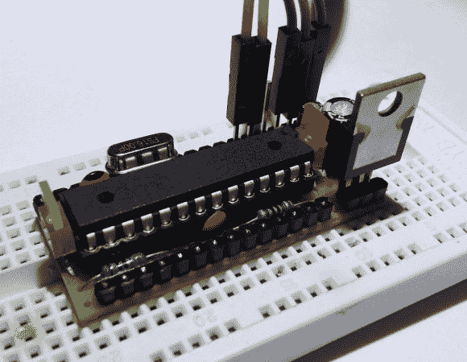

# 构建一个最大化利用不动产的 Arduino 克隆体

> 原文：<https://hackaday.com/2013/07/10/build-a-bare-bones-arduino-clone-which-maximizes-its-use-of-real-estate/>

看看所有塞进一小块长条纸板的东西。它有一个自己滚动的 Arduino 板的典型外观，这正是它。[S. Erisman]向您展示如何构建自己的副本；又一个裸机 Arduino(在 Stripboard 上)。

基板底部的铜条垂直于 DIP 芯片，并在中间被切割。这大大减少了使用 protoboard 时必须进行的跳转次数。几根电线在组成芯片插座的两个加工 SIL 接头之间进行必要的连接。右手边有一个带平滑帽的电压调节器。左侧是强制性的 13 号引脚 LED，在 ATmega328 的另一侧可以看到晶体振荡器。

电路板两侧的引脚接头已被修改，以允许从塑料框架的错误一侧进行焊接。请注意，有一个三引脚大块打破了电压调节器，一个 ISP 编程头伸出顶部，这些母跳线连接。

以 2-4.75 美元一个的价格打电话进来，你将毫无问题地把它留在长厅的一个项目中。我们不能说 30 美元以上的品牌单位也是如此。