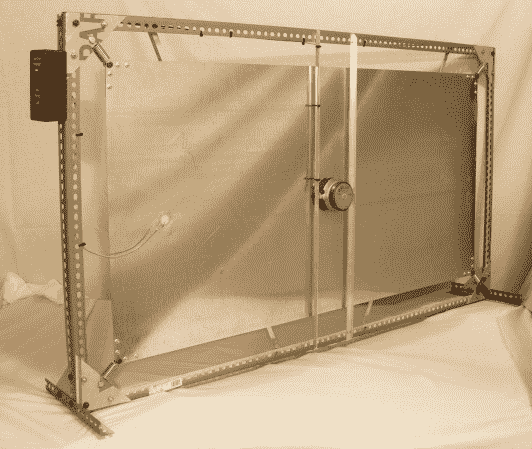

# 建立一个 DIY 板混响

> 原文：<https://hackaday.com/2013/10/14/build-a-diy-plate-reverb/>

【电报】他的录音室需要一个混响。市面上有数百种基于电脑的独立数字混响系统，但他决定[打造自己的平板混响](http://ionosonderec.blogspot.com/2013/04/diy-plate-reverb.html)。[混响是许多专业音频和音乐录音中使用的一种效果](http://hackaday.com/2012/05/19/diy-spring-and-plate-reverb/)。[混响将成千上万的回声添加到音频信号中](http://en.wikipedia.org/wiki/Reverberation)。这些回声的振幅会随着时间的推移而降低。正确使用的话，效果一般都很悦耳。

平板混响使用一块金属板来产生混响。音频驱动器与金属板接触放置。音频被输入驱动器，使板振动。振动沿着板块表面传播，从边缘反弹回来。这些反射被拾音器捕获，然后将其转换为电压信号。当“干”源信号与调音板返回的信号混合时，最终的混响效果实际上是在录音师的调音板中产生的。

[Telegraphy's] plate reverb 几乎完全是由 found、Radio Shack 和五金店零件制成的。板和框架来自洛斯。音频驱动器是一个从旧汽车音响上剪下来的扬声器。拾音器是一个来自 Radio Shack 的改进型压电传感器。正如《电讯报》多次指出的，关于如何以及在哪里安装混响器的各个部分，有很多不同的意见。任何位置都会产生一些混响。问题是在哪里以及如何安装才能达到最佳效果。就像《美人与情人眼里出西施》一样，这个问题的答案就在听者的耳朵里。

跳过休息时间，在[画廊声学工作室](http://www.galleryacoustics.com/)参观一个稍微复杂一点的平板混响。

[https://www.youtube.com/embed/qFCFgvTU_Nw?version=3&rel=1&showsearch=0&showinfo=1&iv_load_policy=1&fs=1&hl=en-US&autohide=2&wmode=transparent](https://www.youtube.com/embed/qFCFgvTU_Nw?version=3&rel=1&showsearch=0&showinfo=1&iv_load_policy=1&fs=1&hl=en-US&autohide=2&wmode=transparent)