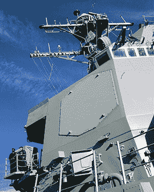

# 在你的车库里建造一个相控阵雷达，可以穿透墙壁

> 原文：<https://hackaday.com/2015/04/07/build-a-phased-array-radar-in-your-garage-that-sees-through-walls/>

直到最近，相控阵雷达还非常昂贵，仅用于生存成本悬而未决的军事应用。随着低成本微波设备和非常规架构的出现，业余爱好者和消费电子产品开发人员现在可以使用相控阵雷达了。在这篇文章中，我们将回顾相控阵雷达的基础知识，并展示如何制作低成本短程相控阵雷达系统的例子——我在我的车库里制作了一个！将相控阵作为您的下一个雷达项目，利用更多元素实现更多感知。

## 相控阵雷达

在[之前的一篇文章](http://hackaday.com/2014/02/24/guest-post-try-radar-for-your-next-project/)中描述了雷达的基础知识，其中一个典型的雷达系统由一个旋转的大型抛物面天线组成。这个天线发射的微波束随着它的旋转扫过地平线。来自目标的散射脉冲显示在称为平面位置指示器(PPI)的极坐标显示器上。

Block diagram of a conventional radar system using a parabolic dish.

在[相控阵雷达](https://www.ll.mit.edu/publications/journal/pdf/vol12_no2/12_2devphasedarray.pdf) (PDF)系统中，使用了一组天线元件来代替碟形天线。这些元件是相位相干的，这意味着它们都以同一个发射机和接收机为相位基准。每个元件都与一个移相器串联，该移相器可以由雷达的控制系统任意调整。通过向每个移相器施加相位旋转来聚焦微波能量束。该波束可以指向阵列视野内的任何地方。为了扫描光束，相应地旋转移相器的相位。像旋转抛物面天线一样，相控阵可以扫描地平线，但不需要使用移动部件。

Simplified block diagram of a phased array radar emitting and receiving a plane wave from a point target.

要扫描整个范围，您通常需要 4 个或更多阵列。这就是为什么 [SPY-1](http://en.wikipedia.org/wiki/AN/SPY-1) 雷达使用 4 块面板分别指向前、后、左、右舷。

  Example of the SPY-1 phased array radar installed aboard the USS Lake Erie  

## 近程相控阵雷达

远程相控阵雷达系统使用相对简单的定相技术来控制波束，从而将微波波束聚焦在远场。我们可能为业余爱好者或消费者应用构建的大多数雷达阵列将使用低成本宽带微波雷达设备在短距离内运行。在这些短距离上，雷达目标通常在近场中，在不考虑波前曲率的情况下，使用传统的远场方法聚焦天线波束变得困难。

当任何一种波从一个声源发出时，它都以球形向外传播。在长距离处，这个球体看起来是平面的(例如平面波),因为球面波从源天线辐射出去时会散开。

[https://www.youtube.com/embed/rqCus4ER1d0?version=3&rel=1&showsearch=0&showinfo=1&iv_load_policy=1&fs=1&hl=en-US&autohide=2&wmode=transparent](https://www.youtube.com/embed/rqCus4ER1d0?version=3&rel=1&showsearch=0&showinfo=1&iv_load_policy=1&fs=1&hl=en-US&autohide=2&wmode=transparent)

有几种方法可以解释短程波前曲率。您可以对每个移相器应用抛物线相位函数，也可以独立接收(或发射)每个元件，并在软件中取消波前曲率。有许多方法可以实现这一点，所有这些方法都不同于传统的相控阵架构。

Scattering of spherical waves from a point target that is in the near-field of a phased array radar.

不幸的是，当设计需要 50、100、1000 或 5000 个元件时，在雷达的有用带宽上使用大量数字化器对于消费产品和爱好者来说仍然过于昂贵。如果你愿意用采集时间换取成本，你可以用开关技术实现一个便宜得多的近场阵列。在本帖中，我们将讨论三个开关阵列雷达系统的例子。

在开关阵列系统中，一个低成本雷达传感器的发射和接收端口使用微波开关在天线单元阵列上切换(或复用)。来自发射和接收元件的每个组合的数据被数字化并存储，其中聚焦(或图像重建)在数字域中被计算。这种方法可以支持 10、20 甚至 40 FPS 的帧速率。这种技术的具体例子如下所示。

## 原型穿墙雷达

任何人都可以构建开关阵列雷达系统。这是一个在我的车库里用 80/20 铝和一些[微型电路](http://www.minicircuits.com/homepage/homepage.html)元件制作的[的例子。数组的大小是由我在当地垃圾场能找到的最长的 6 块 80/20 的 8 英尺 3 英寸来设定的。在这个系统中，我分别通过 13 个和 8 个天线复用了发射机端口和接收机端口。切换序列允许该雷达的相位中心以电子方式沿其长度向下移动，总共有 44 个有效的雷达发射/接收对。我使用了一种](http://glcharvat.com/Dr._Gregory_L._Charvat_Projects/S-Band_MIMO_Phased_Array_Radar.html)[合成孔径雷达(SAR)](http://hackaday.com/2014/03/17/radar-imaging-in-your-garage-synthetic-aperture-radar/) 算法来计算波前曲率以形成图像。

      Garage-built prototype of a through-wall phased-array radar system.

Block diagram of a near-field phased array radar system using antenna multiplexing.

[https://www.youtube.com/embed/W6yod9p8pLM?version=3&rel=1&showsearch=0&showinfo=1&iv_load_policy=1&fs=1&hl=en-US&autohide=2&wmode=transparent](https://www.youtube.com/embed/W6yod9p8pLM?version=3&rel=1&showsearch=0&showinfo=1&iv_load_policy=1&fs=1&hl=en-US&autohide=2&wmode=transparent)

这种雷达的目的是证明在远距离透过混凝土墙成像的概念。它可以通过 4 英寸厚的混凝土墙在 20 英尺的距离范围内成像(我的意思是在墙另一侧的俯视图上显示一个红色的小斑点)一个 12 盎司的汽水罐，对于车库建造的系统来说还不错。

## 从车库到麻省理工学院穿墙雷达

在麻省理工学院林肯实验室的时候，我说服了我的两位同事，[[约翰·皮博迪](http://jpeabodyjr.com)和[[泰勒·罗尔斯顿](http://www.mit.edu/~ty20663/Tyler_S._Ralston.html)]和我一起制作了一个[高性能穿墙成像系统](http://newsoffice.mit.edu/2011/ll-seeing-through-walls-1018)。这个达到了 11 帧/秒，可以轻松穿透 4 英寸、8 英寸和“煤渣砖”墙。

[https://www.youtube.com/embed/H5xmo7iJ7KA?version=3&rel=1&showsearch=0&showinfo=1&iv_load_policy=1&fs=1&hl=en-US&autohide=2&wmode=transparent](https://www.youtube.com/embed/H5xmo7iJ7KA?version=3&rel=1&showsearch=0&showinfo=1&iv_load_policy=1&fs=1&hl=en-US&autohide=2&wmode=transparent)

这个源于车库的项目在 2010 年三军雷达研讨会上赢得了最佳论文奖。详细的学术论文可以在[这里](https://www.ll.mit.edu/mission/space/imagingradar.html)找到。

## 麻省理工学院专业教育/IAP 阵列雷达

出于对麻省理工学院咖啡罐雷达课程的兴趣，我与林肯实验室的同事一起开发了一门[相控阵课程](http://makezine.com/2012/01/24/diy-phased-array-radar-from-pegboard-and-wi-fi-antennas/)。为了制造低成本的学生自制雷达套件，我们添加了一对微波开关，并使用了与穿墙雷达几乎相同的开关阵列布局。这些相控阵雷达设备是使用钉板和 WiFi 天线组装的。这种雷达设备的最新版本达到了每秒 20 帧。任何人都可以用 WiFi 天线和 pegboard 构建一个相控阵雷达。

    Build your own phased array radar out of wi-fi antennas and pegboard.

## 从哪里了解更多信息:

*   世界上最大的相控阵研讨会每 3 年举办一次，[IEEE 国际相控阵系统与技术研讨会 2016](http://array2016.org) 。像大多数 IEEE 活动一样，门票相当便宜，并且有学生项目。将有许多关于相控阵雷达设计和实现的辅导课(短期课程)。
*   相控阵雷达技术最著名的倡导者之一是伊莱·布鲁克纳。
*   在我的书 *[小型短程雷达系统](http://amzn.com/143986599X)* 中详细讨论了开关阵列雷达。

## 摘要

相控阵雷达非常昂贵，传统上用于最先进的防空系统，但今天你可以在短距离内制作自己的雷达。尝试在你的下一个项目中使用相控阵雷达，快速、准确、无移动部件地感知或成像。

## 作者简介

Gregory L. Charvat 制造自己的相控阵列设备，是小型和短程雷达系统的作者，Hyperfine Research Inc .、Butterfly Network Inc .(这两家公司都是 4 家 4catalyzer 公司)的联合创始人，Camera Culture Group 麻省理工学院媒体实验室的客座研究科学家，Gregory L. Charvat 电气工程实用方法系列的编辑，以及 CNN、CBS、Sky News 等的客座评论员。他是麻省理工学院林肯实验室的技术人员，他在穿墙雷达方面的工作赢得了 2010 年 MSS 三军雷达研讨会的最佳论文，并且是 2011 年 Provost 研究亮点的麻省理工学院办公室。他曾在麻省理工学院教授短期雷达课程，他的“构建小型雷达”课程是 2011 年排名第一的麻省理工学院专业教育课程，并被其他大学、实验室和私人组织广泛采用。从早年开始，Greg 开发了许多雷达系统、铁路 SAR 成像传感器、相控阵雷达系统；拥有多项专利；并开发了许多其他传感器、无线电和音频设备。他撰写了许多出版物，并因其作品受到媒体的关注。Greg 于 2007 年获得密歇根州立大学电气工程博士学位，2003 年获得 MSEE 博士学位，2002 年获得 BSEE 博士学位，他是 IEEE 的高级成员，曾在 2010 年、2013 年和 2016 年 IEEE 国际相控阵系统和技术研讨会指导委员会任职，并于 2010 年至 2011 年担任 IEEE AP-S Boston 分会主席。