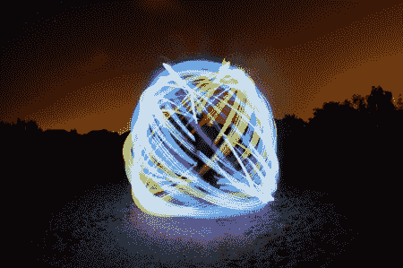

# 建立一个钻机，使你的光画球体

> 原文：<https://hackaday.com/2012/05/01/build-a-rig-to-make-orbs-in-your-light-paintings/>

我们已经在这里介绍了大量的光绘项目。人们总是在这个相当新的媒介中寻找新的方法来创造有趣的东西。这个项目涵盖了在你的光画中创建球体或球体的方法。作者指出，目前许多人这样做是通过将光源放在一根绳子的末端，像螺旋桨一样在他们面前摆动，然后慢慢地转一圈。他想让这个过程自动化一点，所以他[组合了他的电动望远镜三脚架、一个电钻](http://www.diyphotography.net/over-the-top-orb-with-a-telescope-mount-a-drill)、一条 RGB LEDs 和一些碎木头。他现在有一个自动化系统来制作完美的球体。他展示的一些例子相当惊人。