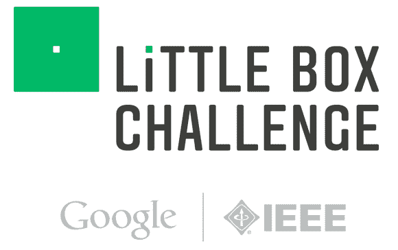

# 制造高效逆变器，赢得一百万美元

> 原文：<https://hackaday.com/2014/08/10/build-an-efficient-inverter-win-a-million-dollars/>

谷歌和 IEEE 将向能够制造出最高效、最紧凑的 DC 到交流逆变器的个人或团队颁发 100 万美元的奖金。目标是设计和制造一台功率密度大于 50W 立方英寸的 2kW 逆变器。客观地说，传统的太阳能串逆变器的功率密度约为 0.5-3W/立方英寸，微型逆变器约为 5W/立方英寸。换句话说，比我们现在的效率高出一个数量级。

为了应对这一挑战，逆变器需要将 450VDC 转换为 240VAC @ 60Hz，其中 10 ohm 串联电阻模拟太阳能电池阵列。测试将包括为 0-2 千伏安范围内的各种电阻、电感和电容负载供电。逆变器应在 5%内调节电压，在 0.05%内调节频率，同时保持外壳温度低于 60 摄氏度，并符合 FCC 第 15 B 部分(非故意辐射)。

如果你和/或你的团队能够找出最有效的拓扑结构、开关频率、高功率[宽带隙(WBG)半导体](http://wikipedia.org/wiki/Wide_bandgap_semiconductors)的新用途，从物理上减小输入和输出滤波器的尺寸，并保持整个系统冷却运行。然后在 2014 年 9 月 30 日截止日期前注册。逆变器需要能够正常工作，并且在 2015 年 7 月 22 日之前发送该[测试程序](http://www.littleboxchallenge.com/pdf/LBC-InverterRequirements.pdf) (PDF 警告)的结果，然后将选出 18 名决赛选手，在 2015 年 10 月 21 日之前将他们的逆变器带到美国的测试机构。大奖得主将于 2016 年 1 月公布

[感谢提示 Dmytro]

这款 [Arduino 电源逆变器](http://hackaday.com/2013/06/21/an-arduino-power-inverter/)需要认真升级才能进入。说到参加挑战，现在参加我们自己的[黑客日大奖](http://hackaday.io/prize)还为时不晚！