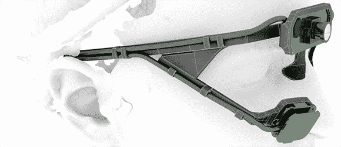

# 花 90 美元打造一款眼球追踪耳机

> 原文：<https://hackaday.com/2013/02/12/build-an-eye-tracking-headset-for-90/>

眼球追踪是一项非常酷的技术，应用于语言学、人机交互和市场营销等多个领域。有了合适的眼球追踪设置，网站开发者就有可能看到他们对布局的改变是否有效，衡量人们阅读一页文本的速度，甚至诊断医疗疾病。然而，眼球追踪系统并不便宜，[至少到目前为止](http://code.google.com/p/pupil/)。瞳孔是一个严肃的、研究质量的眼球追踪耳机，由[Moritz]和[William]为他们在麻省理工学院的论文设计。

Pupil 背后的基本思想是将一台数码相机面向用户的眼睛，而另一台相机面向世界。在校准包含的软件后，耳机会观察用户的瞳孔，以确定他们实际上在看哪里。

硬件一点也不专业——只有一对 20 美元的 USB 网络摄像头、一个 LED、一个由曝光的 35mm 胶片底片制成的红外滤光器，以及一个 3D 打印耳机[，在 Shapeways](http://www.shapeways.com/model/789833/pupil-headset.html?li=productBox-search) 很方便地出售。

面向学生的软件基于 OpenCV 和 OpenGL，可用于 Mac 和 Linux。正如在休息后的视频中看到的那样，校准很容易，对于一个不到 100 美元的眼球跟踪耳机来说，结果是惊人的。

[https://player.vimeo.com/video/53258604](https://player.vimeo.com/video/53258604)[//player.vimeo.com/video/53171811](//player.vimeo.com/video/53171811)