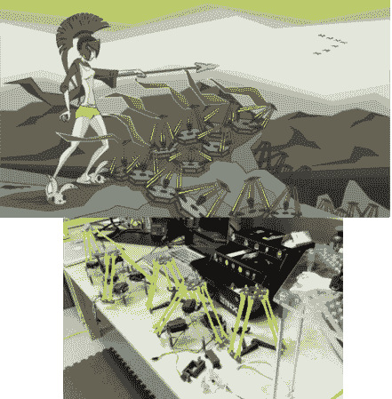

# 建立和控制你自己的机器人军队

> 原文：<https://hackaday.com/2013/11/29/build-and-control-your-own-robot-army/>

[莎拉·佩特库斯]有一个简单的梦想。她想建立并指挥自己的三角洲机器人军队。这一切都始于她画的一幅画，画中一个女人徘徊在一片花田之上。在这种情况下，花朵以白炽灯泡为花朵。[莎拉]决定在现实世界中创造她的形象，作为一个互动的艺术装置。她的[第一次尝试移动光花](http://www.youtube.com/watch?v=G4sr19-kVTo)是基于滑轮系统，这是不可靠的，也不完全是她想象的优雅运动。最终[莎拉]发现了倒三角机器人。她把自己的花卉设计改成了三角形，并开始用家里的零件[制作自己的三角形机器人](http://www.youtube.com/watch?v=B0GzXAP9fQQ)。

在拉斯维加斯的 SYN Shop hackerspace 与人们的一次偶然会面，NV 公司启动了这个项目。[Sarah]从使用遥控球链作为接头切换到简单的滚珠轴承接头。她用 CAD 软件创建了她的整个设计，并在 hackerspace 的 3d 打印机上打印出来。她现在有六个工作原型。这些机器人都是由兼容 Arduino 的 Nymph 板通过 I2C 控制的。六个机器人并不能完全构成一支军队，所以[莎拉]必须找到一种新的方式来资助她的项目。她目前正在为 Kickstarter 建立一个项目。[Sarah]将为她的机器人出售套件，收入将用于实现她的机器人灯泡花领域的梦想——假设 deltas 不会变得有意识并试图首先接管世界。【莎拉】[在她的博客](http://roboticarts.wordpress.com/)上发布进度更新，并有一个[专用网站](http://lightplay.zoness.com/)(我们在周日[作为链接帖子](http://hackaday.com/2013/11/24/hackaday-links-november-24-2013/)的一部分展示了该网站)提供关于她即将到来的 Kickstarter 活动的信息。

[https://www.youtube.com/embed/JrjK_CHtSck?version=3&rel=1&showsearch=0&showinfo=1&iv_load_policy=1&fs=1&hl=en-US&autohide=2&wmode=transparent](https://www.youtube.com/embed/JrjK_CHtSck?version=3&rel=1&showsearch=0&showinfo=1&iv_load_policy=1&fs=1&hl=en-US&autohide=2&wmode=transparent)