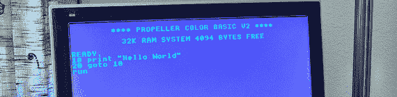

# 用视差推进器建造 80 年代的微型计算机

> 原文：<https://hackaday.com/2012/06/08/building-a-1980s-microcomputer-with-a-parallax-propeller/>

Gadget Gangster 公司的人拿出一台可指示的 T1 来建造一台 80 年代的 8 位微型计算机。尽管他们使用的是现代组件，但它仍然让人回想起 10 岁的孩子学习 6502 汇编的时候，偷看和戳是编程的最佳方式，使用鼠标是一件新奇的事情。

该构建使用一个[视差推进器](http://www.parallax.com/tabid/407/Default.aspx)开发板为一个简单的微控制器提供惊人的马力。在通过 RCA 插孔将螺旋桨连接到电视上并添加红外键盘后，Gadget Gangster 拥有了一台可以从 SD 卡加载程序的简单计算机。

因为如果不会编程，微型计算机就没用了，Gadget Ganster [把 BASIC](http://www.instructables.com/id/Build-your-own-pocket-mini-computer/) 移植到了螺旋桨上。凭借 VGA 和声音输出，以及添加 PS/2 键盘和 Wii 控制器的能力，这款现代经典机型比几十款 Commodore 64s 更强大。

作为一个小题外话，我们没有看到足够的建设使用螺旋桨。至少可以说，并行处理微控制器的计算能力是低端 ARM 处理器的 10 倍，这很有趣；老实说，我们对螺旋桨项目的缺乏感到困惑。如果你有一个螺旋桨项目，把它发送到[提示行](http://hackaday.com/contact-hack-a-day/)。