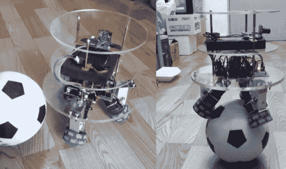

# 建造一个球平衡机器人

> 原文：<https://hackaday.com/2013/10/24/building-a-ball-balancing-robot/>

如果你想要一种不同的反馈系统挑战，抛弃赛格威式的机器人，建造一个可以在球上保持平衡的机器人。 UFactory 是深圳的一家初创公司，这个令人印象深刻的小家伙展示了他们应用于经典倒立摆的技能。这款机器人身高近 18 英寸，体重刚刚超过 6 磅，除了加速度计和陀螺仪之外，还拥有许多功能:它既有 WiFi 模块，又有摄像头，可以通过自制的遥控器或 Kinect 进行控制。

该建筑使用塑料全方位轮连接到 3 个有刷直流电机，这些电机通过定制的铝支架连接到机器人的底座。UFactory gang 用三个丙烯酸圆盘构建了机器人的身体，这些圆盘将电子设备直接固定在轮子上方。大脑似乎是一个 STM32 微控制器，连接到电机和传感器。

你还不会在他们的 Instructable 上找到代码，但是根据评论，他们计划将整个项目开源。如果你迫切需要更多的细节，UFactory 团队似乎愿意通过电子邮件提供源代码和其他信息。请确保在休息后观看视频，尤其是他们演示干扰和负载的结尾。这不是我们看到的第一个球摆。与 2010 年的[ball ball ball ball ball ball ball ball ball ball ball ball ball ball ball ball ball ball ball ball ball ball ball ball ball ball ball ball ball ball and ball ball ball ball ball ball ball ball ball ball and ball ball ball ball ball ball ball ball ball ball ball ball ball ball ball ball robot](http://hackaday.com/2010/04/30/ball-inverted-pendulum/)一起踏上回忆之旅。

[https://www.youtube.com/embed/dr5xdpLL58A?version=3&rel=1&showsearch=0&showinfo=1&iv_load_policy=1&fs=1&hl=en-US&autohide=2&wmode=transparent](https://www.youtube.com/embed/dr5xdpLL58A?version=3&rel=1&showsearch=0&showinfo=1&iv_load_policy=1&fs=1&hl=en-US&autohide=2&wmode=transparent)