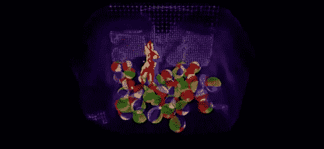

# 用…传呼机马达打造更好的 Kinect？

> 原文：<https://hackaday.com/2012/08/13/building-a-better-kinect-with-a-pager-motor/>

微软研究部门最新推出的[是一种减少干扰](http://www.youtube.com/watch?v=CSBDY0RuhS4)和减少 Kinect 错误的巧妙方法。额外收获:这项技术只需要一个重量偏置的马达，或者只是一个寻呼机用的超大振动马达。

作为第一款商用 3D 深度传感器，Kinect 上的跟踪功能真的没有那么好。在我们看过的每一个 Kinect 演示中，3D 追踪总是有错误或者点云中缺少数据。微软研究所称之为“震动感”,通过用单个电机振动红外投影仪和相机，就可以解决这些问题。

除了从 Kinect 获得高质量的点云，这项技术还允许在同一房间使用多台 Kinect。在视频中(也是这篇文章的标题图片)，你可以看到一个家伙在一个充满 3D 沙滩球的房间里走来走去，这是从四个 Kinects 阵列中捕捉到的。

这为 Kinect 的当前版本不可能实现的大量构建打开了大门，但我们认为这太容易了，也太聪明了，以前不可能不想到。我们很想看到这项技术的一些独立验证，所以如果你有一个 Kinect 项目，给它绑上一个马达，制作一个视频，然后[发送到](http://hackaday.com/contact-hack-a-day/)。

[https://www.youtube.com/embed/CSBDY0RuhS4?version=3&rel=1&showsearch=0&showinfo=1&iv_load_policy=1&fs=1&hl=en-US&autohide=2&wmode=transparent](https://www.youtube.com/embed/CSBDY0RuhS4?version=3&rel=1&showsearch=0&showinfo=1&iv_load_policy=1&fs=1&hl=en-US&autohide=2&wmode=transparent)