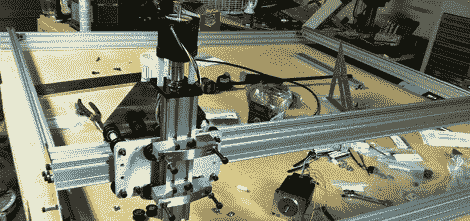

# 建造更大的 Shapeoko 路由器

> 原文：<https://hackaday.com/2012/09/17/building-a-bigger-shapeoko-router/>

Hackaday 的校友(Will O'Brien)提交了几个他最近在升级工作空间的过程中一直在做的项目。他正在基于 Shapeoko 路由器制造一台 [1200 x 1200 mm 的 CNC 路由器](http://powercordlabs.com/1200mm-x-1200mm-shapeoko-build/)，看起来他确实乐在其中。

[Shapeoko 路由器](http://www.shapeoko.com/)基于 Makerslide [开源直线轴承系统](http://hackaday.com/2011/05/10/open-source-linear-bearing-system/)。该系统使用普通铝型材作为非常简单、非常便宜的 CNC 刳刨机的框架。Makerslide 系统被设计成可扩展的；如果你想要一个更大的轴，只需螺栓在一个更长的铝挤压件。我们还没有看到许多 Makerslide 构建利用这一事实，这是一个遗憾，因为 stock Shapeoko 只有 200 平方毫米的构建面积。

[威尔]正在将这个建筑面积扩大到 1200 平方毫米，当然这意味着要加强建筑的某些部分。他已经将 Nema 23 步进电机提升到了非常大的 250 盎司/英寸(高于标准 Shapeoko 的 Nema 17s ),并且大大增强了电机座。

[威尔]还采购了一些长度的[电缆拖链](http://biobug.org/index.php/2012/09/11/cnc-machinerobotic-cable-management/)(是的，*就是这么叫的*，以使他的巨大 CNC 路由器的所有电线远离移动的龙门架和旋转的电机。看起来他已经有了很好的体型，我们迫不及待地想看到他的表现。