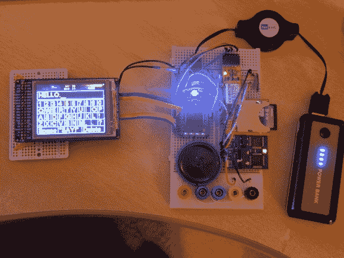

# 构建基于眨眼的输入设备

> 原文：<https://hackaday.com/2013/06/20/building-a-blink-based-input-device/>

AMC 剧集《绝命毒师》的粉丝们会记得原版黑帮[赫克托·萨拉曼卡]。当第一次听到这个故事时，他通过摇铃来交流。但在被转移到疗养院后，他在一名护士的帮助下通过拼写信息进行交流，护士拿着一张写有一排排字母的卡片。这个黑客自动化了这项任务，[用基于眨眼的输入系统](http://mbed.org/users/RorschachUK/code/BlinkTalk/)取代了人工助手。

[鲍勃·斯通]称这个项目为 BlinkTalk。用户佩戴 Neurosky Mindwave 移动耳机。这是用脑电图测量脑电波。他使用 BlueSMiRF 蓝牙板将耳机连接到 mBed 微控制器。微控制器处理 EEG 数据以确定用户何时眨眼。

LCD 屏幕首先向下滚动显示的每一行字母和数字。当适当的行被突出显示时，闪烁将开始在列中滚动，直到第二次闪烁选择适当的字符。一旦信息被拼写出来，“说！”菜单项使[em C2 模块](http://hackaday.com/2012/07/11/emic2-text-to-speech-module/)将文本转换成语音。

如果你认为你可以建造这样的东西来帮助残疾人，你应该去 thecontrollerproject.com 看看，在那里建筑商和有需要的人联系在一起。

[https://www.youtube.com/embed/BVYUHJmaFZY?version=3&rel=1&showsearch=0&showinfo=1&iv_load_policy=1&fs=1&hl=en-US&autohide=2&wmode=transparent](https://www.youtube.com/embed/BVYUHJmaFZY?version=3&rel=1&showsearch=0&showinfo=1&iv_load_policy=1&fs=1&hl=en-US&autohide=2&wmode=transparent)