# 围绕创成式设计和 3D 打印奇迹建立业务

> 原文：<https://hackaday.com/2015/08/28/building-a-business-around-generative-design/>

创成式设计是一种通过将种子数据输入算法来创造东西的方法。起初可能很难想象有人会如何围绕这一点建立业务，但这正是神经系统取得巨大成功的原因。秘密不仅仅在于算法，还在于他们如何把它变成现实。

该公司由麻省理工学院的毕业生杰西卡·罗森克兰茨(Jessica Rosenkrantz)和杰西·路易斯·罗森伯格(Jesse Louis-Rosenberg)在波士顿地区创立。他们生产各种各样的商品，从家具到珠宝、游戏，当然还有艺术品(包括服装——稍后再详细介绍)。所有这些的特别之处在于，客户可以成为设计过程中不可或缺的一部分。他们几个产品的工作流程始于[一个基于网络的设计工具](https://n-e-r-v-o-u-s.com/cellCycle/)，它可以让你从一个简单的设计开始，然后把它变成你自己的设计。

 [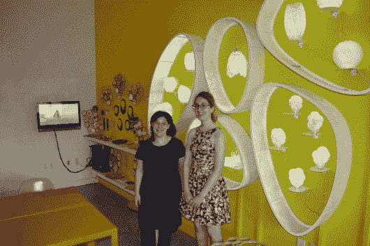](https://hackaday.com/2015/08/28/building-a-business-around-generative-design/dsc_0137/) Sophi Kravitz and Jessica Rosenkrantz at Nervous System Studio [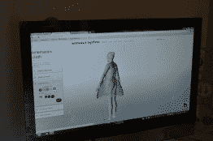](https://hackaday.com/2015/08/28/building-a-business-around-generative-design/dsc_0139/) Generative Garments can only be designed on-site [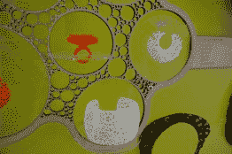](https://hackaday.com/2015/08/28/building-a-business-around-generative-design/dsc_0142/) Ring, neclace, and bracelet designs [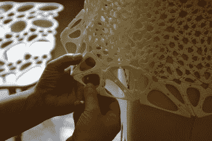](https://hackaday.com/2015/08/28/building-a-business-around-generative-design/dsc_0153/) Dress 3D printed as one piece [![Kinematics Dress is now in the MoMA [image source: Nervous System]](img/b9f3c0edd981c4bf5d384c08ec50951a.png "kinematics-dress")](https://hackaday.com/2015/08/28/building-a-business-around-generative-design/kinematics-dress/) Kinematics Dress is now in the MoMA [image source: Nervous System]

神经系统因设计[运动服装](http://n-e-r-v-o-u-s.com/projects/sets/kinematics-dress/)而闻名。这是一件利用选择性激光烧结(SLS)技术用尼龙一次性 3D 打印出来的连衣裙。为了让它适合打印机，服装[必须在软件](http://n-e-r-v-o-u-s.com/projects/tags/algorithm/albums/kinematics-fold/)中“折叠”，这是一个非常酷的设计技巧！不幸的是，这不是最舒适的衣服，所以这绝对是一件艺术品。这是目前在纽约现代艺术博物馆展出的[。](http://www.moma.org/explore/inside_out/2015/03/26/future-couture-nervous-systems-kinematics-dress)

 [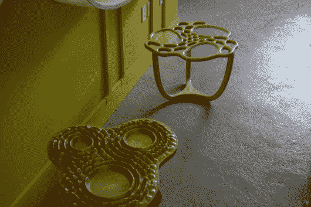](https://hackaday.com/2015/08/28/building-a-business-around-generative-design/dsc_0144/)  [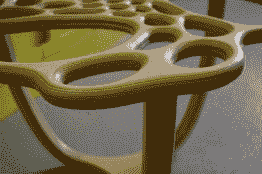](https://hackaday.com/2015/08/28/building-a-business-around-generative-design/dsc_0145/)  [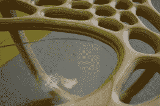](https://hackaday.com/2015/08/28/building-a-business-around-generative-design/dsc_0147/) Acrylic cut to fit perfectly in the openings  bookshelves [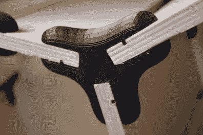](https://hackaday.com/2015/08/28/building-a-business-around-generative-design/dsc_0150/) 3D printed connectors are keyed

当你进入工作室时，展示的是他们一直在试验的家具。[茶几](http://n-e-r-v-o-u-s.com/projects/tags/product/albums/radiolaria-table/)由胶合板铣成。形状感觉非常有机，但不难使丙烯酸片贴合；CNC 在这方面很擅长。

这些书架已经用了好几年了。[Jessica]提到她添加了 3D 打印连接器的钥匙，因为木材会随着时间的推移而收缩，如果没有这种漂亮的设计细节，舒适的安装很容易将您的书倾倒在房间各处。如果你对这些[感兴趣，看看他们发布的 Github 回购](https://github.com/nervoussystem/bookshelf)。

  3D Printed Material Finishing Bench [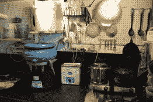](https://hackaday.com/2015/08/28/building-a-business-around-generative-design/dsc_0154/) Everything is so tidy! [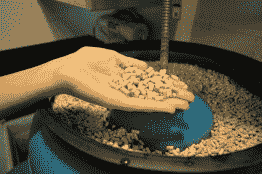](https://hackaday.com/2015/08/28/building-a-business-around-generative-design/dsc_0174-2/) Ceramic polishing medium

他们绝大多数的 3D 打印产品都是由最好的设备在场外完成的。但是它会被运到这个工作室去完成。这从振动抛光机开始，在那里陶瓷介质使物品光滑。直接从打印机，他们有一个从 SLS 过程中产生的粉状纹理。

如果顾客选择了一种颜色，这些物品就会按照规格进行染色。我们参观的那天，有一批珠宝浸泡在黑色染料中。

 [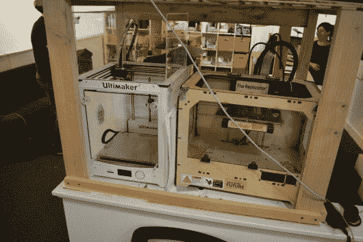](https://hackaday.com/2015/08/28/building-a-business-around-generative-design/dsc_0188-2/) Ultimaker 2 and Makerbot Replicator (original) [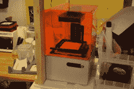](https://hackaday.com/2015/08/28/building-a-business-around-generative-design/dsc_0187/) Formlabs Form 1  Autodesk Ember  Table saw for cutting plywood to size [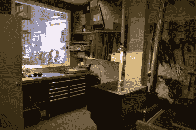](https://hackaday.com/2015/08/28/building-a-business-around-generative-design/dsc_0160-2/) Laser Cutter used to produce puzzles

在研发方面，团队在现场有很多玩具。我没有拍下所有 3D 打印机的照片，但这里有一些有趣的照片。其余的店铺面积实际上是用于生产的。激光切割机用于制作下图所示的拼图。他们已经走上了一条昂贵的道路，学习激光能做什么，不能做什么；削减拼图中的严格公差对步进电机来说是很高的要求。

  Coral printed in 3D [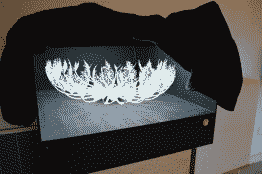](https://hackaday.com/2015/08/28/building-a-business-around-generative-design/dsc_0176-3/) Zoetrope [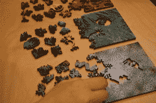](https://hackaday.com/2015/08/28/building-a-business-around-generative-design/dsc_0180/) Puzzles with custom art    Puzzle-within-a-puzzle

把最有趣的留到最后总是好的。彩色印刷的珊瑚雕塑令人叹为观止。我无法想象除了 3D 打印之外，还有哪种工艺可以制造出这样的东西。沿着类似的路线是他们展出的石兽。这是一个在暗箱中旋转的雕塑，灯光随着旋转同步闪烁。结果是[一个三维雕塑就在你眼前生成](http://n-e-r-v-o-u-s.com/projects/sets/zoetropes/)。

也许最具吸引力的将是生成性拼图游戏。其中许多并没有那么大，大约有一大片面包那么大。但是它们包含了许多形状奇妙异想天开的作品。最后一个谜题非常壮观。在整个设计中，它包括不同颜色的部分。这些可以单独拿出来做一个单独的圆形拼图。在狂热的解谜者要求更具挑战性的东西后，拼图中的拼图设计被开发成超级困难的。祝你好运！

神经系统是建立在一个非常有趣的想法上的，而且执行得非常好。感谢你打开了 Hackaday 的大门，并向我们展示了你如何制作所有这些精彩的作品！