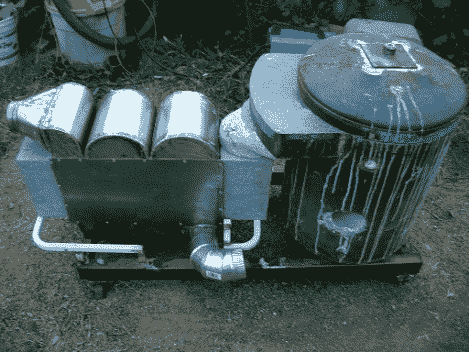

# 建造带有热交换器的铸造炉

> 原文：<https://hackaday.com/2012/08/13/building-a-casting-furnace-with-heat-exchanger/>

这个完全 DIY 的铸造炉非常棒，这要感谢一路上投入的所有工作。他想用一个更高效的炉子替换他的旧炉子，为此，他在设计中内置了一个热交换器。这样排气将预热进气。

炉子本身是从一个旧电热水器的外壳开始的。除了设计过程，大部分的构建都涉及到模具制作。对于圆形部分，他使用的是 quick tube，这是一种用于浇注混凝土基脚的纸板模板。对于更复杂的部分，他塑造了聚苯乙烯。它们被分层放置，然后注入高温水泥形成永久部件。硬化后，聚苯乙烯可以大块移除。

热交换器是左边的部分。它包括几个由水泥制成的宽而平的管道，用于排出废气。在这些管道周围，蜿蜒的金属槽输送进气，当进气经过排气管时吸收热量。

第一次使用新熔炉时，他熔化了一堆废铝并浇铸了铝锭。

[谢谢 DC3]