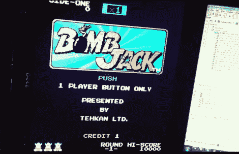

# 在 FPGA 中构建经典投币游戏

> 原文：<https://hackaday.com/2012/09/05/building-a-classic-coin-op-game-in-an-fpga/>

这个炸弹杰克的游戏和原版街机版本一样。不同的是，这个硬件是使用互联网上的原理图在 FPGA 中构建的。

我们对这样一个项目的复杂性感到有点震惊。我们之前已经对使用 FPGAs 实现经典 CRT 矢量图形的[印象深刻。但是那个项目使用了一个已经实现了原始游戏的库。为此，[Alex]希望找到一款从未被转化为 FPGA 的游戏，并使用库存零件。](http://hackaday.com/2012/03/16/crt-vector-graphics-arcade-game-built-from-an-fpga-board/)[炸弹杰克](http://en.wikipedia.org/wiki/Bomb_Jack)是 1984 年的平台，运行在 Z80 处理器、AY-3-8192 声音发生器和普通 TTL 逻辑芯片上。这意味着他不必自己编写内核，而是使用已经存在的芯片版本，将硬件编码在一起。

你可以在顶部链接的页面上阅读他的经历，或者在休息后跳转来观看最终项目的视频。你可以看到显示器在它的侧面，游戏听起来很棒，运行完美。

[https://www.youtube.com/embed/AAJYzKkvExI?version=3&rel=1&showsearch=0&showinfo=1&iv_load_policy=1&fs=1&hl=en-US&autohide=2&wmode=transparent](https://www.youtube.com/embed/AAJYzKkvExI?version=3&rel=1&showsearch=0&showinfo=1&iv_load_policy=1&fs=1&hl=en-US&autohide=2&wmode=transparent)