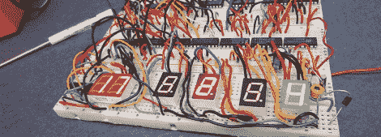

# 在试验板上构建 CMOS 时钟

> 原文：<https://hackaday.com/2012/06/28/building-a-cmos-clock-on-a-breadboard/>

如果你打算学习数字逻辑，为什么不胸怀大志呢？当[他们只用 4000 系列逻辑芯片建造了一个时钟](http://geekness.eu/content/4000-series-cmos-24-hour-clock)时，这就是【伊斯顿】和他的朋友所做的。在一块试验板上。

对于一个 1 Hz 的时钟，[Easton]和他的朋友使用了一个 4060 计数器和一个触发器。这一过程会持续 59 秒，直到在与门的帮助下，秒计数器归零。在对分钟重复这一过程并为小时建立了类似的电路后，[伊斯顿]有了一个工作的 4000 系列 24 小时时钟。

试验板时钟可能不是最漂亮的东西，也不是如何制作电路原型的教科书示例，但这是通过[Easton]朋友的 12 小时时钟 PCB 布局解决的。我们找不到任何照片，但我们确信这很棒，是学习逻辑和设计的好方法。