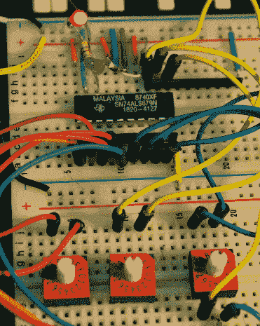

# 用逻辑芯片制作密码锁

> 原文：<https://hackaday.com/2012/03/30/building-a-combination-lock-with-logic-chips/>

元件之神一定对[Darrell]微笑了，因为他最近在当地的大学盈余中碰到了一个装满 7400 系列逻辑芯片的柜子。所有常规器件——触发器、逻辑门和 SRAMs 都在 DIP 封装中。随着数字的增加，7400 系列逻辑芯片变得非常深奥，所以当[Darrell]发现 74ALS679 地址比较器时，他并没有完全意识到他拥有什么。在快速浏览相关数据表后，他对这个芯片的实际功能有了一个相当好的想法，于是[决定制作一个密码锁](http://needsmorelasers.com/articles/14/simple-electronic-combination-lock-using-the-sn74als679)。

从[的数据表](http://www.ti.com/lit/ds/sdas003c/sdas003c.pdf)，【Darrell】弄明白了这个小逻辑芯片如何只用 20 个引脚来比较两个 12 位地址:12 个地址引脚中的每一个都被硬连线以匹配一个 4 位值。如果 4 位“key”设置为 0110，则前 6 个地址引脚连接到低电平，引脚 7-12 连接到高电平。在将他的地址比较器连接到三个六角 dip 开关后，[Darrell]有了一个使用单词“FAB”作为钥匙的密码锁。

在 7400 系列逻辑芯片中，有一些古怪的东西；7447 七段显示驱动程序很有用，但是 74881 ALU 和 74361 bubble memory 时序发生器并不是你在随机组件仓库中能找到的。如果你有一个奇怪的逻辑芯片(有一个 300 波特的调制解调器，你知道)，[在](http://hackaday.com/contact-hack-a-day/)发送它。休息之后，你可以看看[达雷尔]的锁的动画 gif。

