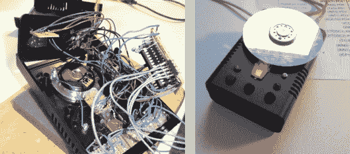

# 构建硬盘擦除控制器

> 原文：<https://hackaday.com/2013/08/02/building-a-hard-drive-scratch-controller/>

如果你正在读这篇博客，那么很有可能你家里某个地方挂着一个死硬盘。这里有一个周末项目，将把它重新投入使用。[Andreas]承担了一个受欢迎的项目，该项目将硬盘驱动器和光电鼠标结合起来，构建一个 scratch 控制器。

构建的要点是使用光学鼠标传感器来跟踪盘片的移动。但是[Andreas]没有使用鼠标的 USB 功能，而是根据自己的需要将其映射到软件中，这让事情变得更加困难。相反，他从鼠标上取下传感器，用 Arduino 读取。经过多次反复试验，他找到了最好的方法来覆盖盘片的底部，以更好地与传感器配合，他设法让它运行起来。控制器使用 MIDI 协议发布命令，为未来的升级奠定了坚实的基础，这可能会导致全面的 DJ 控制台黑客攻击。

[https://www.youtube.com/embed/VMg3spZM-Ow?version=3&rel=1&showsearch=0&showinfo=1&iv_load_policy=1&fs=1&hl=en-US&autohide=2&wmode=transparent](https://www.youtube.com/embed/VMg3spZM-Ow?version=3&rel=1&showsearch=0&showinfo=1&iv_load_policy=1&fs=1&hl=en-US&autohide=2&wmode=transparent)