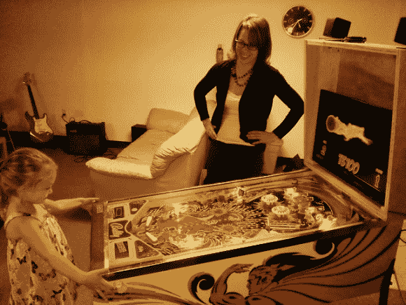

# 在操场上建造一个完整的弹球机

> 原文：<https://hackaday.com/2013/08/19/building-a-pinball-out-of-its-playfield/>

这一切都是从[Iancole] [在某知名拍卖网站上花 135 美元买了一个火球家庭版 playfield](http://www.raisinggeeks.com/blog/2013/08/making-fireball-hd-pinball/) 开始的。最初，他打算用 Arduino 来点亮这些灯，将它装框，然后挂在他办公室的墙上——这在旧弹球部件上[经常发生。但随后他的孩子们问他是否“能让它播放”。](http://hackaday.com/2012/05/05/using-pinball-score-reels-as-wireless-displays/)

[Iancole]设法在网上找到了弹球示意图，并开始设计许多 led、螺线管和开关所需的电子设备。由于 led 和开关在同一个矩阵上，他选择了一个简单的 Arduino 来循环通过它们，给玩家一种灯一直亮着的印象。[Iancole]最初计划使用他的 raspberry Pi 来控制螺线管，但后来他改用了另一个 Arduino，因为需要精确的计时。

因此，他的圆周率被用作机器的心脏。它与两个 Arduinos 接口，在运行游戏程序、在 24 英寸屏幕上显示高清图形、播放音乐和游戏事件声音时读取状态和发送命令。所有的电子产品都自豪地展示在后箱上，并为其规划了许多开发项目。此外，该机器将于 10 月 5 日在奥兰多迷你创客博览会上展出！