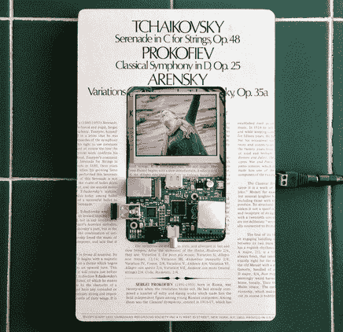

# 制作树莓皮数码相框

> 原文：<https://hackaday.com/2014/01/04/building-a-raspberry-pi-digital-photo-frame/>

如今，数码相框本身并不十分有趣，但用树莓皮制作一个并为其捆绑一堆有用的功能可能会激励你去看看这篇关于制作一个[“活的”数码相框的教程。](http://www.ofbrooklyn.com/2014/01/2/building-photo-frame-raspberry-pi-motion-detector/)

这是[Samuel]的第一个树莓派项目，所以他决定制作一个数码相框，能够从他的 Flicker 帐户下载随机图片，并以幻灯片格式显示。由于 Raspi 上有所有额外 IO，所以很容易集成状态 LED 和 PIR 传感器。当 PIR 传感器检测到运动时，相框被启用；在 60 秒没有移动之后，通过关闭监视器端口来禁用相框。

我们喜欢找到这样的详细资料，因为这里有很多有用的信息，比如使用 Flicker API、GPIO 控制、图像处理、如何配置脚本以在启动时运行，甚至还有一些很棒的故障排除代码。如果你宁愿完全放弃 Raspi，把事情往下进行几个层次，看看这个基于 [PIC 的 100% DIY 数码相框。](http://hackaday.com/2009/01/08/how-to-digital-picture-frame-100-diy/)