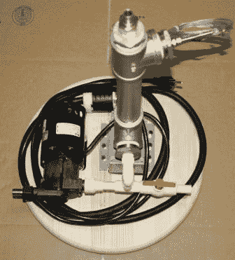

# 为你的酿造乐趣建造一个循环注入糖化醪系统

> 原文：<https://hackaday.com/2012/09/12/building-a-recirculating-infusion-mash-system-for-your-brewing-pleasure/>

如果你对全谷物酿造感兴趣，那么一点点自动化会大有帮助。[汤姆·哈格雷夫]看上了一个循环输液糖化系统(RIMS)，但价格标签让他不敢扣动扳机。最近，他咬紧牙关，自己造了一个小而便宜的轮圈，与他用作麦芽酒罐的 10 加仑冷却器一起使用。

[糖化](http://en.wikipedia.org/wiki/Mashing)是酿造过程的一部分，从碾碎的谷物中收集糖分。水需要通过谷物糖化醪，应该保持在一个狭窄的温度范围内。这种 RIMS 硬件通过组合泵、电热水器的加热元件和温度传感器来自动完成这项工作。木制圆盘安装在醪桶的顶部，管道让泵根据需要移动液体。这个版本中缺少的一个东西是 PID 控制器来自动执行这个过程。休息之后，我们嵌入了一个独立项目的视频，展示了 PID 控制如何与这样的系统一起工作。

如果你喜欢自动化家庭酿造，你也会喜欢这个小批量酿造装置。

[https://www.youtube.com/embed/OUTJE3HG9Vk?version=3&rel=1&showsearch=0&showinfo=1&iv_load_policy=1&fs=1&hl=en-US&autohide=2&wmode=transparent](https://www.youtube.com/embed/OUTJE3HG9Vk?version=3&rel=1&showsearch=0&showinfo=1&iv_load_policy=1&fs=1&hl=en-US&autohide=2&wmode=transparent)