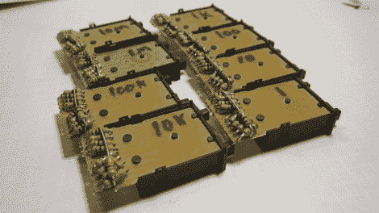

# 构建电阻替代十进制盒

> 原文：<https://hackaday.com/2012/08/21/building-a-resistor-substitution-decade-box/>

[乔治]建造了一个非常整洁的电阻替代十进制盒子。这些器件具有一对连接和一种选择两者之间电阻的方法。在[乔治的]情况下，它是一对香蕉插孔和这八个指轮开关。

你在上面看到的是每个指轮开关的侧面。这些是面板安装设备，显示一个数字，带有上下按钮来改变设置。可以看到，每个的 PCB 都提供了可以安装一组电阻的连接。这是他不遗余力解释的难点。

此时，他已经将每个数字的电阻组焊接到位，下一步是将开关堆叠在一起并进行电气连接。从那里它被送到一个项目箱，在那里它们将被安装。

这个项目很好地解释了组装过程。如果你对替换盒背后的理论感兴趣，可以看看这个项目。