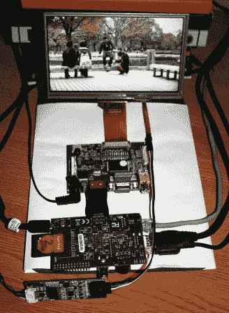

# 用 Raspberry Pi 构建触摸屏 XBMC 设置

> 原文：<https://hackaday.com/2013/03/02/building-a-touchscreen-xbmc-setup-with-the-raspberry-pi/>

[Andrei Istodorescu]一直在努力工作[建立一个 7 英寸的触摸屏钻机运行 XBMC](http://www.engineering-diy.blogspot.ro/2013/02/raspberry-pi-raspbian-xbmc-and-egalax-7.html) 。这可能是颠倒的，但树莓 Pi 板是前面和中心仍然很容易辨认。为了实现这一点，有很多东西与它相连，甚至更多的软件配置。但是正如你在广告之后的视频中看到的，他确实做到了！

这个屏幕是他在易贝买的 eGalaxy 7”触摸感应模块。这听起来像是汽车仪表板上的备用摄像头。他编译了自己的 Linux 内核来增加对屏幕的支持。它使用 HDMI 作为与驱动板的视频接口，触摸屏连接到其中一个 USB 端口。其余的设置包括编译支持触摸屏的 XBMC，并校准屏幕以准确感应输入。

[https://www.youtube.com/embed/WbxRf8BejnY?version=3&rel=1&showsearch=0&showinfo=1&iv_load_policy=1&fs=1&hl=en-US&autohide=2&wmode=transparent](https://www.youtube.com/embed/WbxRf8BejnY?version=3&rel=1&showsearch=0&showinfo=1&iv_load_policy=1&fs=1&hl=en-US&autohide=2&wmode=transparent)