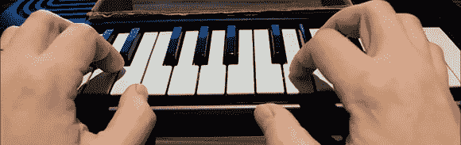

# 构建速度敏感键盘

> 原文：<https://hackaday.com/2013/01/29/building-a-velocity-sensitive-keyboard/>

便宜的玩具钢琴通常没有 MIDI，从沃尔玛的玩具货架上拿一个速度敏感键盘几乎是不可能的。但是，如果你愿意拆开这些玩具钢琴中的一个，并建立自己的控制电子设备，天空是无限的，正如【JenShen】用[他自制的速度感应键盘](http://www.codetinkerhack.com/2013/01/how-to-add-velocity-aftertouch-midi.html)向我们展示的。

通常，力度敏感键盘在每个键下有两个按钮。通过让微控制器测量每个按钮被按下的时间差，就有可能感知每个键被按下的速度。[JenShen]将速度感应键盘的想法带到了另一个方向，而是使用了一个力敏电阻条，[切割成许多块](http://www.codetinkerhack.com/2012/12/poor-mans-force-sensitive-resistor-fsr.html)来提供速度和触后数据。

[JenShen]的键盘将这些电阻按钮添加到他已经制作的按钮矩阵[中。结果是一个非常便宜的带有触后响应的速度敏感键盘，对于一个 Arduino 和仅有的几个组件来说，这是一个令人印象深刻的壮举。](http://hackaday.com/2012/11/28/turning-toy-pianos-into-midi-keyboards/)

休息之后，您可以查看键盘的运行情况。

[https://www.youtube.com/embed/yIBBxDHOa0g?version=3&rel=1&showsearch=0&showinfo=1&iv_load_policy=1&fs=1&hl=en-US&autohide=2&wmode=transparent](https://www.youtube.com/embed/yIBBxDHOa0g?version=3&rel=1&showsearch=0&showinfo=1&iv_load_policy=1&fs=1&hl=en-US&autohide=2&wmode=transparent)