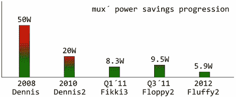

# 构建功耗极低、功能齐全的台式机

> 原文：<https://hackaday.com/2012/09/09/building-a-very-low-power-full-featured-desktop/>

几年来，[mux]一直在进行极其高效的计算。2010 年，他建造了一台功能齐全的 MiniITX / Core 2 duo 计算机，功耗仅为 20 瓦。去年，[mux]成功打造了一款基于英特尔 i3 的台式机，在空闲时功耗仅为 8.3 瓦。他又回来了，现在他的目标是一款功能齐全的英特尔 i5 处理器，内置显示器[，功耗不到 6 瓦](http://ssj3gohan.tweakblogs.net/blog/8217/fluffy2-59-watt-high-end-desktop-computer.html)。

像他之前的 [8 瓦 i3 版本](http://ssj3gohan.tweakblogs.net/blog/6112/85w-core-i3-based-desktop-computer-(english).html)一样，【mux】通过仔细测量电路板上每个组件的功耗来降低他的版本的功耗要求。任何电源都可以节省电能；当从交流转换到 DC，或者从一个 DC 电压转换到另一个时，在这个过程中总会有一点点功率损失。

[mux]通过移除几个电压调节器并在主板上重新布线电源线来减少这些功耗。到目前为止，[mux]电脑的耗电量是零件库存时的一半以上，我们迫不及待地想看到包括内置显示器、UPS 和适当外壳的成品。