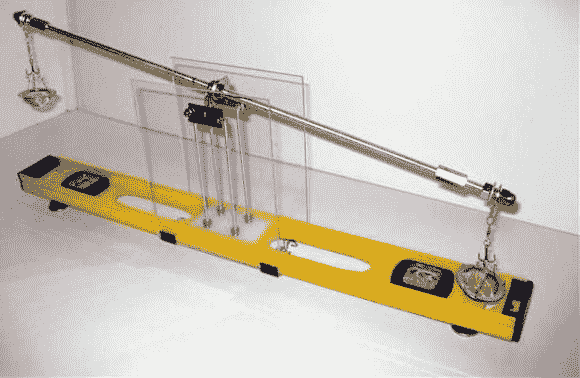

# 建立精确的等臂平衡

> 原文：<https://hackaday.com/2013/08/18/building-an-accurate-equal-arm-balance/>

这个有趣的度量衡使用两英尺长的水平仪作为 diy 等臂平衡的基础。天平是最古老的测量质量的方法。这是因为你甚至不需要一个参考重量就能让它工作，只要你测量的是整数比例的成分。

这些秤准确性的关键是减少支点处的摩擦。在这种情况下，支点由底座上的两个朝上的刀片组成，其中一个刀片垂直于手臂上的刀片。但是因为重力在做均衡，所以底座必须尽可能的水平。可调脚被添加到基地，使它可以在两个轴水平。当在中心的塔被建造(使用螺纹杆)的时候，一个圆盘水平仪被用来微调两个剃刀刀片的安装角度。最后的润色包括两端用于微调天平的连接螺母，以及作为称量容器的茶球过滤器的两半。