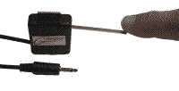
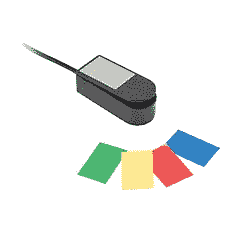
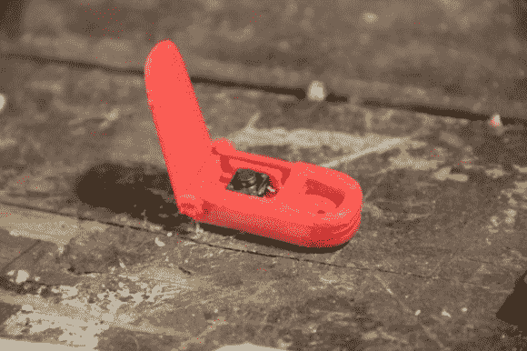

# 为身体残疾的人构建定制的游戏控制器

> 原文：<https://hackaday.com/2013/06/20/building-custom-game-controllers-for-people-with-physical-disabilities/>

抓紧了。这将是一篇长文。我在视频中保持了我的脾气，但在这里我可以直接出来让你知道我很愤怒。每次开始想到这些，我就觉得又气又无奈，脸发烫，手发抖。不过，我说得有点超前了，所以让我们稍微回顾一下，谈谈一个叫[托马斯]的非常酷的孩子。

[托马斯]有肌肉萎缩症。这意味着随着时间的推移，他将逐渐失去力量和对肌肉的控制。他已经失去了站立的能力，甚至长时间按住游戏手柄上的按钮都很困难。可以想象，游戏对托马斯和像他这样的人来说非常重要。它像对我们所有人一样，提供了一种沮丧的释放，但也提供了一个公平的竞争环境。当他在比赛时，他和其他人一样。

[https://www.youtube.com/embed/Ts1TpWo9njk?version=3&rel=1&showsearch=0&showinfo=1&iv_load_policy=1&fs=1&hl=en-US&autohide=2&wmode=transparent](https://www.youtube.com/embed/Ts1TpWo9njk?version=3&rel=1&showsearch=0&showinfo=1&iv_load_policy=1&fs=1&hl=en-US&autohide=2&wmode=transparent)

我对可用的硬件做了一些快速调查。这就是我开始生气的地方。像这种低压开关这样简单的东西价格极其昂贵。就拿这两个来说吧。两者都是带有电缆和外壳的单个瞬时开关。

  market price $79  market price $69

70 美元？ **$70 F*$ & ING 美元**？这不是电脑界面，这只是开关。我们都知道，我们可以用不到一美元的*零售价*买到这些交换机。在这一点上，我想“伙计，这些公司肯定是夸大了保险公司的价格。”

我向[托马斯的]母亲提到了保险的想法。她说了一些让我想坐下来哭的话。她回答道"**哦，不，保险公司通常不会赔偿这种东西。他们不认为这是必要的。**“也许是因为我是一名家长，但这是毁灭性的。在这次访问后的一段时间里，我甚至很难思考海峡。我是如此的愤怒，如此的沮丧，如此的无助，而*我只是一点点被牵扯进来*。

我下定决心要做的不仅仅是为[托马斯]做一个简单的控制器，我需要帮助尽可能多的人。稍后会详细介绍。

## [托马斯的]控制器。

正如你在视频中看到的，[托马斯]喜欢玩 minecraft。我和他见了面，讨论了他对控制器的需求。在这个时间点上，[托马斯]真的不需要太多。他可以使用 Xbox 游戏手柄、六轴控制器、键盘和鼠标。他按住扳机超过几秒有点困难，但他挺过来了。

这意味着我真的没有具体的问题要解决，所以我只是试图建立一些东西来帮助尽可能多的人。我从一个想法跳到另一个想法，但最终还是想到了可以根据需要重新配置的模块化按钮。

 [")](https://hackaday.com/2013/06/20/building-custom-game-controllers-for-people-with-physical-disabilities/img_7407-small/) lap board configuration [")](https://hackaday.com/2013/06/20/building-custom-game-controllers-for-people-with-physical-disabilities/img_7413-small/) teensy [")](https://hackaday.com/2013/06/20/building-custom-game-controllers-for-people-with-physical-disabilities/img_7409-small/) all the bits

我使用了一个非常简单的键盘/鼠标模拟代码。这允许我在不使用额外软件的情况下给游戏输入。我应该在这里指出，这不是一个新的或惊人的想法。我前面提到的超级昂贵的按钮直接插入一个模拟鼠标和键盘的“开关盒”中。通常开关盒甚至有很多我的没有的功能。

 [")](https://hackaday.com/2013/06/20/building-custom-game-controllers-for-people-with-physical-disabilities/img_7429-small/)  [")](https://hackaday.com/2013/06/20/building-custom-game-controllers-for-people-with-physical-disabilities/img_7428-small/)  [")](https://hackaday.com/2013/06/20/building-custom-game-controllers-for-people-with-physical-disabilities/img_7424-small/)  [")](https://hackaday.com/2013/06/20/building-custom-game-controllers-for-people-with-physical-disabilities/img_7423-small/)  [")](https://hackaday.com/2013/06/20/building-custom-game-controllers-for-people-with-physical-disabilities/img_7422-small/)  [")](https://hackaday.com/2013/06/20/building-custom-game-controllers-for-people-with-physical-disabilities/img_7421-small/)  [")](https://hackaday.com/2013/06/20/building-custom-game-controllers-for-people-with-physical-disabilities/img_7416-small/)  [")](https://hackaday.com/2013/06/20/building-custom-game-controllers-for-people-with-physical-disabilities/img_7415-small/)  [")](https://hackaday.com/2013/06/20/building-custom-game-controllers-for-people-with-physical-disabilities/img_7417-small/)  [")](https://hackaday.com/2013/06/20/building-custom-game-controllers-for-people-with-physical-disabilities/img_7419-small/)  [")](https://hackaday.com/2013/06/20/building-custom-game-controllers-for-people-with-physical-disabilities/img_7414-small/)  [")](https://hackaday.com/2013/06/20/building-custom-game-controllers-for-people-with-physical-disabilities/img_7413-small/) teensy [")](https://hackaday.com/2013/06/20/building-custom-game-controllers-for-people-with-physical-disabilities/img_7412-small/)  [")](https://hackaday.com/2013/06/20/building-custom-game-controllers-for-people-with-physical-disabilities/img_7411-small/)  [")](https://hackaday.com/2013/06/20/building-custom-game-controllers-for-people-with-physical-disabilities/img_7409-small/) all the bits [")](https://hackaday.com/2013/06/20/building-custom-game-controllers-for-people-with-physical-disabilities/img_7410-small/)  [")](https://hackaday.com/2013/06/20/building-custom-game-controllers-for-people-with-physical-disabilities/img_7406-small/)  [")](https://hackaday.com/2013/06/20/building-custom-game-controllers-for-people-with-physical-disabilities/img_7405-small/)  [")](https://hackaday.com/2013/06/20/building-custom-game-controllers-for-people-with-physical-disabilities/img_7407-small/) lap board configuration [")](https://hackaday.com/2013/06/20/building-custom-game-controllers-for-people-with-physical-disabilities/img_7403-small/)  [")](https://hackaday.com/2013/06/20/building-custom-game-controllers-for-people-with-physical-disabilities/img_7408-small/) 

我所做的就是模拟 W，A，S，D，空格，escape，E，Q，鼠标移动，鼠标左右点击。就是这样。这就是 minecraft 所需要的一切。我最初开始制作一个使用耳机插孔的系统，就像我在其他系统上看到的那样，但后来有了一个更好的想法。通过让接头可用，人们可以真正地将两根电线插入其中，并模拟键盘按键。需要一个只需很小压力就能激活的按钮(很常见)？没有压力怎么样。

由于托马斯仍然可以使用键盘和鼠标，我的控制器对他没有多大帮助。他在这方面表现得很好，我们将保持未来的沟通，因为不幸的是，他将永远无法使用键盘和鼠标。

## 文件

我不是工程师。我只是看看那里有什么，然后开始做超快的 3d 打印案例。它们并没有经过深思熟虑，但它们确实有效。幸运的是，Lulzbot 为这个项目给了我一台 3d 打印机，所以我能够很快地制作原型并进行测试。请下载这些并改进它们。

这是零件。

### 1.低压杠杆启动瞬时开关。

使用一个非常便宜的 6mm 瞬时开关，这种情况下使用一个杠杆激活减少大约 15 克所需的压力。它的工作原理就像上图中的一样，我认为即使我把劳动力也算在内，它也不到 30 美元。有几个变化主要是因为我没有一个好的铰链的想法。

[在此下载低压开关](http://www.thingiverse.com/thing:106420)。

### 2.键盘和四键按钮

这只是 4 毫米瞬时开关的一种情况。这些没有杠杆，需要大约 60 克的压力才能推动，这与 Xbox 控制器差不多。他们并不完美，但他们的工作。

有些人提到他们认为 D-pad 需要更多的按钮才能像 Xbox one 一样。如果你拆开一个 Xbox 控制器，你会看到里面只有 4 个按钮。这不是一个 8 路系统。

你也可以看到我打印的控制器形状的块来容纳这些。

[在此下载 D-Pad 文件](http://www.thingiverse.com/thing:106411)。

[在此下载四按钮文件](http://www.thingiverse.com/thing:106415)。

另一方面，使用柔性绞合线。我不知道我在想什么在这里使用实心丝带。他们不会持续很久。

您可以从这个项目下载更多的文件:

[PSP 拇指套](http://www.thingiverse.com/thing:106418)

[单按钮外壳](http://www.thingiverse.com/thing:106422)(最终版本中未使用)

[贴东西的空白控制器形状](http://www.thingiverse.com/thing:106453)。

## 你能帮什么忙？

如我所说。我不能一走了之。我从想我会做一个(托马斯)东西，到想我会做一个对每个人都完美的东西！我甚至考虑在 kickstarter 上做点什么，为自己做点小生意。然而，这些想法都不太对劲。

我意识到我不需要通过制造一个控制器来帮助所有人。虽然我确实为托马斯做了一件东西，但我的技能不一定是制造东西。我的技能是分享信息，联系人们，建立社区。

我创造了 Thecontrollerproject.com。这是一个人们可以提供服务来构建自定义界面的论坛。你不需要无偿贡献你的时间。即使有劳动力，这些简单的界面中的一些可以在家里比商业版本更便宜。许多人需要商业上没有的定制。

[https://www.youtube.com/embed/Rd1MkQAdmoU?version=3&rel=1&showsearch=0&showinfo=1&iv_load_policy=1&fs=1&hl=en-US&autohide=2&wmode=transparent](https://www.youtube.com/embed/Rd1MkQAdmoU?version=3&rel=1&showsearch=0&showinfo=1&iv_load_policy=1&fs=1&hl=en-US&autohide=2&wmode=transparent)

你们中的许多人在想“哦，工程师会处理这些事情的”。别说了。你也可以帮忙。

即使你从未焊接或接触过微控制器，我也会亲自张贴一些简单易懂的说明，教你如何为人们制作一些简单的设备。如果你想帮忙，可以。请吧。我求你了。

## 不想工作，只想捐款怎么办？ ****

好吧，那很好，但是不要给我捐款。前往[Ablegamers.com](http://ablegamers.com)向精英玩家基金会捐款。他们为和我一样的目标奋斗，并且一起行动。他们已经在帮助各地的人们，他们比我更需要你的帮助。看看下面这个关于能力玩家基金会的视频。

[https://www.youtube.com/embed/BM8iNa87-Po?version=3&rel=1&showsearch=0&showinfo=1&iv_load_policy=1&fs=1&hl=en-US&autohide=2&wmode=transparent](https://www.youtube.com/embed/BM8iNa87-Po?version=3&rel=1&showsearch=0&showinfo=1&iv_load_policy=1&fs=1&hl=en-US&autohide=2&wmode=transparent)