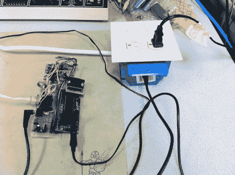

# 构建互联网控制设备的后端

> 原文：<https://hackaday.com/2012/05/28/building-the-backend-of-internet-controlled-devices/>

[亚当]和[杰里米]接受了设计一个系统的挑战，这个系统将使从互联网上控制电器变得容易。这个概念我们已经见过很多次了。它涉及到一些切换电源和连接到互联网的机制的方法。这个设计计划周密，执行良好。

像这样的项目，我们总是对电源切换非常感兴趣。一个被认可的电箱容纳了项目中所有的高压部件，这很好。这里，GA8-2B02 固态继电器在进线和两个插座之间切换电源。我们没有看到盒子，但希望在这些电线和低压控制电线之间有一个隔板，它使用标准的 3.5 毫米音频插孔作为互连。

ATmega644 驱动继电器的控制信号。它通过以太网电缆连接到互联网，使用 ENC28J60 芯片负责局域网通信。这本质上是一个轻量级的网络服务器，可以很容易地接受来自任何网络发送者的命令。

[谢谢布鲁斯]