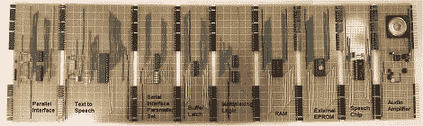

# 构建机器人霸主的思维

> 原文：<https://hackaday.com/2012/04/19/building-the-mind-of-a-robot-overlord/>

路易斯维尔黑客空间 LVL1 的人们现在有了一件[令人难以置信的墙壁艺术品](http://wiki.lvl1.org/Speaking_Wall_Art)，它也是一个语音合成器。语音合成器有两英尺多长，由九块条形板和直角头连接而成。一件令人敬畏的艺术品。

这个语音合成器实际上已经研制了 30 年。[20 世纪 80 年代初](http://wiki.lvl1.org/Speech_Synthesizer,_Now_from_the_Past)，LVL1 的一个成员在 Radio Shack 的一个垃圾箱里，隔着几个文本到语音的 IC。这些集成电路被搁置在抽屉里，而大学成了阻碍，1990 年，[这个项目又复活了。语音合成器芯片在抽屉里又放了十年，最终决定为 LVL1 建造一个壁挂式语音合成器。](http://wiki.lvl1.org/Text_to_Speech_Synthesizer)

这个语音合成器旨在成为 LVL1 的第二个黑客空间 AI“父亲”的语音信箱。第一个人工智能——母亲——已经[告诉人们把垃圾拿出去](http://hackaday.com/2012/02/20/robot-overlords-require-chores-in-return-for-technological-access/),并试图成为我们都应得的人工智能。父亲将在机器猴子中实现[，所以现在我们唯一的问题是谁在搞乱路易斯维尔的供水系统。](http://wiki.lvl1.org/Disturbing_Robot_Project)