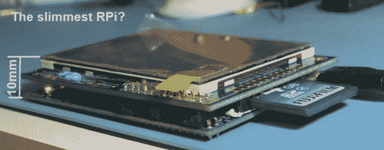

# 打造最纤薄的 Raspi

> 原文：<https://hackaday.com/2014/07/17/building-the-slimmest-raspi/>

[Colin]，又名[Domipheus]，正在做一个项目，用一个安装在墙上的树莓 Pi 和一个触摸屏来监控恒温器。很简单，但 Pi 有一个问题:插头都在电路板的周围，并且有一个 TFT 触摸屏屏蔽，它有点太厚了，不能安装在墙上。接下来是最纯粹意义上的黑客行为:[Domipheus]移除并重新放置 Pi 上的组件[，直到整个 Pi/display 堆栈只有 10 毫米多高](http://labs.domipheus.com/blog/pi-on-the-wall-wall-mounted-home-server-part-2-diet-pi/)。

Raspberry Pi 型号 A 用于此构建，这意味着以太网插孔已经消失，只有一个 USB 端口需要处理。尽管如此，最高的组件 RCA 和音频插孔-太高了，需要拆除；无论如何它们都不会被使用。

在这些组件消失后，[Domipheus]将注意力转向电路板上第二高的部分:保险丝、盖子和 HDMI 端口。由于担心在正确移除 HDMI 连接器时损坏周围的组件，这部分被简单地砍掉了。USB 电源连接器附近的大钽帽被移除(它只是一个滤波器帽)，大保护二极管被移动到其他地方。

如果没有显示屏，减肥是没有好处的，为此，Domipheus 使用了 Adafruit 的触摸屏。当项目需要移除 LCD 的能力时，事情变得有点复杂，但是你可以用一个 DIP 插座和一个文件做一些令人惊奇的事情。

最终的结果是一个带有触摸屏的树莓皮，仅比 CD 盒厚一点点。它将紧靠在重新设计的外壳中的一面墙上，最终结果看起来非常专业。

[感谢卢克通过 [reddit](http://www.reddit.com/r/raspberry_pi/comments/2aujrx/pi_on_the_wall_home_server_10mm_thin_including/)