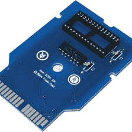

# 构建您自己的雅达利墨盒

> 原文：<https://hackaday.com/2012/06/16/building-your-own-atari-cartridges/>

你有没有想过从头开始创作自己的雅达利游戏？多亏了 Grand Idea Studio，你可以将文件下载到[制作你自己的盒式印刷电路板](http://www.grandideastudio.com/portfolio/pixels-past/)。这里没有太多的信息，因为这是一个不再受支持的老项目。但是，您可以下载适用于 atari 2600 三种主要型号的手推车的说明、原理图和 gerber 文件。正如 Adafruit 公司的泰勒指出的，你也可以很容易地 [3d 打印出你自己的外壳](http://www.adafruit.com/blog/2012/06/15/create-custom-atari-games-with-pixels-past-circuit-boards/)。