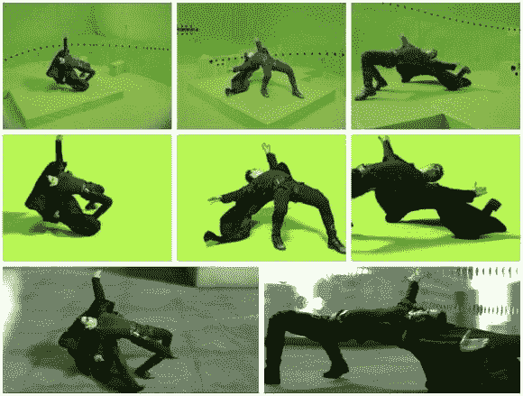
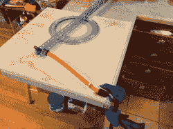
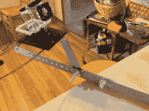
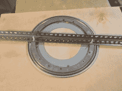

# 单个 GoPro 的子弹时间

> 原文：<https://hackaday.com/2013/03/20/bullet-time-with-a-single-gopro/>

[https://www.youtube.com/embed/e04PVFe5LMM?version=3&rel=1&showsearch=0&showinfo=1&iv_load_policy=1&fs=1&hl=en-US&autohide=2&wmode=transparent](https://www.youtube.com/embed/e04PVFe5LMM?version=3&rel=1&showsearch=0&showinfo=1&iv_load_policy=1&fs=1&hl=en-US&autohide=2&wmode=transparent)

本周早些时候，我看了一个视频，展示了一些人如何使用 15 个叫做“GoPros”的小型坚固耐用的相机制作一些非常酷的子弹时间效果(这不是付费代言，他们很棒)。对于那些不熟悉的人来说，子弹时间效果从第一部《黑客帝国》电影开始流行起来。当[尼奥]躲开一些子弹时，镜头放慢到慢动作，但摄像机仍然能够四处移动。为此，他们建造了一个巨大的圆形钻机，并在周围安装了数吨摄像机。利用这些多重角度，他们能够以慢动作将场景拼接在一起，并“移动”摄像机。

我知道多摄像机方法是可行的，但我也知道许多制作公司已经转向一种新方法，在快速精确的机械臂上使用单个高清慢动作摄像机。他们可以拍摄他们需要的酷炫照片，并且可以灵活地更改相机拍摄的路径。这里唯一的缺点是你不能完全停止时间并围绕物体旋转。~~我现在找不到视频~~，但有一个很棒的视频展示了他们如何使用这个工业手臂来移动相机，同时倒酒，或绕着一套鼓。

[//player.vimeo.com/video/43455552](//player.vimeo.com/video/43455552)

我决定我可以很容易地建立一个钻机，让我在慢动作时做一个旋转的效果。我选择了最简单快捷的路线，那就是把一只手臂放在一个“懒苏珊”上。然后我在手臂末端放了一个 GoPro Hero3，将录制模式设置为 120fps，并让它旋转。

[https://www.youtube.com/embed/-8Ap3hXnNjc?version=3&rel=1&showsearch=0&showinfo=1&iv_load_policy=1&fs=1&hl=en-US&autohide=2&wmode=transparent](https://www.youtube.com/embed/-8Ap3hXnNjc?version=3&rel=1&showsearch=0&showinfo=1&iv_load_policy=1&fs=1&hl=en-US&autohide=2&wmode=transparent)

旋转手臂越快，效果看起来越像子弹时间。否则，它看起来只是一个漂亮的旋转运动。结果很棒，尽管慢动作镜头只有 720p。

未来一些可能的改进是为中间的东西添加一个平台。我本来打算这样做，但我使用的金属在延伸那么远时弯曲得太厉害了。有一点点的摇晃，一些额外的重量在懒惰的苏珊可能会清除它。