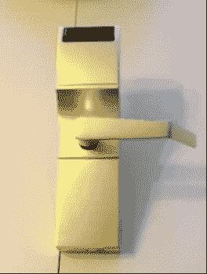

# 窃贼涉嫌使用 Arduino-Onity Hack 抢劫酒店房间

> 原文：<https://hackaday.com/2012/11/29/burglar-suspected-of-using-arduino-onity-hack-to-rob-hotel-rooms/>

有人能反对这是市场上最不安全的酒店房间锁吗？普通读者会认出这是一个 Onity 钥匙卡锁。几个月前，一个明显的安全漏洞被曝光，使得这些锁可以在不到一秒钟内被电子打开。因此，当我们听说休斯顿的一系列酒店房间抢劫案被怀疑使用了这种技术时，我们并不感到惊讶。

上面的图片来自我们在十月份看到的演示视频。这个黑客在一个干擦记号笔内使用了一个兼容 Arduino 的芯片作为锁的电子设备的终端。当科迪·布罗西厄斯·T2 在今年的黑帽大会上展示这个漏洞时，他再次发出了警告。门锁外 的*T5 上的桶形插孔兼作单线通信端口，这就是攻击者可以获得访问的方式。调查人员找不到这些盗窃的其他进入方式。*

我们为这个故事中的一位受害者鼓掌。在文章的结尾，她被问到关于 Onity 缺陷的信息是否应该保密。她说，如果有一个漏洞没有被修复，人们有权知道它。好极了[珍妮特·沃尔夫]！

[谢谢安德鲁]