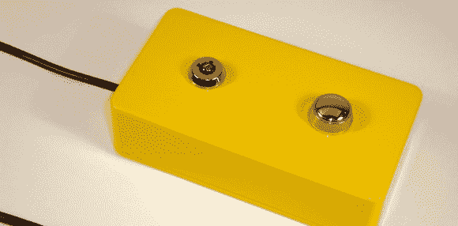

# 按钮自动告诉人们离开 Gmail

> 原文：<https://hackaday.com/2012/11/22/button-automatically-tells-people-to-bugger-off-in-gmail/>

[Kevin]的朋友是一位非常乐于助人的工程师，当他的朋友被要求在几个项目上提供帮助时，他总是很难拒绝。真的，[Kevin]的朋友的时间太宝贵了，无法承担更多的项目，但拒绝某人会拖累你。为了让他的朋友免受拒绝的折磨，[凯文]开发了一个自动 Gmail 助手，它会自动回复一封烦人的电子邮件，上面写着:“去你妈的！”。

自动化的 Gmail 助手是围绕一个 Teensy 2.0 微控制器构建的，该微控制器配备了一个作为安全措施的密钥，以免一个意外的“操你妈”被发送给朋友、家人或雇主。

如果[凯文]的朋友因为责备这么多人而感觉不好，还有一个方便的功能可以确保这位工程师朋友不会显得太没用:有百分之一的几率 Gmail 助手会回复:“这是个好主意，我会马上去做的！”。