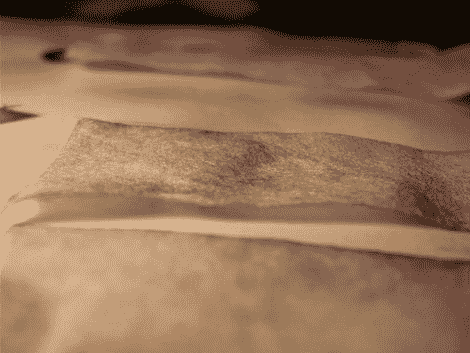

# 讨厌卷心菜的人可以把他们的剩菜变成石蕊试纸

> 原文：<https://hackaday.com/2012/04/23/cabbage-haters-can-turn-their-leftovers-into-litmus-paper/>

[威廉·菲纽肯]正在利用卷心菜的力量制作自己的石蕊试纸。这个过程比 T2 制作的人造火药要简单得多，因为它只需要一种成分和一些厨房工具。

如果你已经忘记了你的高中化学，石蕊是一组染料，当暴露于碱性或酸性物质时会改变颜色。它通常以液体或纸张的形式存在。[威廉]正在从红色卷心菜的叶子中获取染料，他只需用少量的水将半个头挤过搅拌机。一旦它变成果肉并在微波炉中煮沸(嗯，闻起来一定很棒！)他用咖啡过滤器分离液体。一个新鲜的咖啡过滤器作为底物的供体，只需将一些条浸在卷心菜汁中，然后让它们干燥。休息后，你可以用一些氨水来测试它们，或者开始抓水槽下面的东西，看看会发生什么。

[https://www.youtube.com/embed/nfWSZU4fqcg?version=3&rel=1&showsearch=0&showinfo=1&iv_load_policy=1&fs=1&hl=en-US&autohide=2&wmode=transparent](https://www.youtube.com/embed/nfWSZU4fqcg?version=3&rel=1&showsearch=0&showinfo=1&iv_load_policy=1&fs=1&hl=en-US&autohide=2&wmode=transparent)