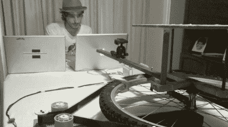

# 停止运动电影制作人一起砍相机娃娃

> 原文：<https://hackaday.com/2012/08/29/camera-dollies-hacked-together-by-stop-motion-filmmakers/>

在定格动画方面，一点点技术就能帮上大忙。在这种情况下，它是在一部名为《T2》的短片制作过程中制作的三个简单的摄影小车。

推车是一种安装相机的方法，以便在拍摄过程中可以平稳地移动相机。当然，定格运动实际上发生在两个镜头之间，所以准确地移动摄像机更加重要。休息后的视频展示了他们如何为摄像机添加 CNC 控制。第一个推车是由一对 PVC 管和一个沿着它们移动的雪橇制成的。一个马达带动一圈 35 毫米的胶卷，胶卷固定在小车上。这是一个很好的材料选择，因为它不会拉伸，而且是免费的(其中一个电影制作人是放映员)。下一个推车是由平板扫描仪制成的，最终产品见上图。它由一个自行车车轮制成，为模型提供了一个位于轮毂上方的固定平台，而相机则在连接到车轮的臂上旋转。你可以在这里观看完整的电影。

如果你正在寻找更多的灵感，看看这个双轴 PVC 推车项目。

[https://www.youtube.com/embed/kHXanDTE9E4?version=3&rel=1&showsearch=0&showinfo=1&iv_load_policy=1&fs=1&hl=en-US&autohide=2&wmode=transparent](https://www.youtube.com/embed/kHXanDTE9E4?version=3&rel=1&showsearch=0&showinfo=1&iv_load_policy=1&fs=1&hl=en-US&autohide=2&wmode=transparent)