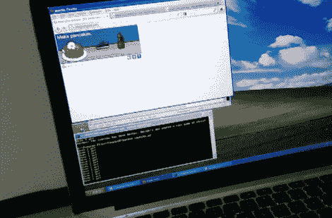

# 验证码机器人击败新的你是一个人类游戏吗

> 原文：<https://hackaday.com/2012/05/25/captcha-bot-beats-new-are-you-a-human-playthru-game/>

你在薄煎饼上放什么？黄油和糖浆却没有一双鞋？这对我们来说是有意义的，这也是新的验证码游戏 PlayThru 的前提。通常由几乎难以辨认的文本填充的空间现在被一个基于图形的小游戏占据，在这个游戏中，你可以将适当的项目拖动到屏幕的一部分。除了比破译字母更容易之外，这个新平台不应该需要本地化。但是，唉，这个系统似乎已经崩溃了。[Stephen]给我们发了一个链接，链接到一个可以通过 PlayThru 验证码的机器人。

休息后看一下视频，看看四次测试。看起来机器人只是在识别可移动的物体并进行试验。有时这很快，有时不是。但它最终还是成功了。对于 PlayThru 开发人员来说，这应该很容易解决，只需为尝试错误的项目设置一个错误限制。无论如何，我们不认为击败当前的系统会像击败 reCaptcha 一样困难。

**更新:**【泰勒】在[你是人类吗](http://areyouahuman.com/)写信来分享他们的故事。显然，我们看到机器人在玩游戏，但不一定会通过。直到游戏结束，游戏信息被发送到他们的服务器，才决定游戏是否成功。这样，他们可以随时从服务器端更改身份验证参数。

与此同时，[斯蒂芬]更新了他的机器人，[制作了一个视频](http://www.youtube.com/watch?v=q_EYl83vlIw)，视频中它在煎饼上没有任何鞋子的情况下玩游戏。

[https://www.youtube.com/embed/Ahu3fvW2H0E?version=3&rel=1&showsearch=0&showinfo=1&iv_load_policy=1&fs=1&hl=en-US&autohide=2&wmode=transparent](https://www.youtube.com/embed/Ahu3fvW2H0E?version=3&rel=1&showsearch=0&showinfo=1&iv_load_policy=1&fs=1&hl=en-US&autohide=2&wmode=transparent)

JavaScript:(function(){ var vidID = prompt('输入 YouTube 视频 ID ')；window . open([http://img.youtube.com/vi/&# 8217](http://img.youtube.com/vi/&#8217))；+ vidID + '/0.jpg')})()