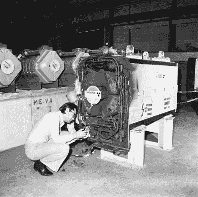
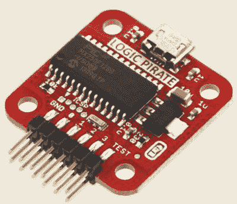

# 描述 CERN 竞赛——意外发生

> 原文：<https://hackaday.com/2015/05/14/caption-cern-contest-accidents-happen/>

第 14 周的形象可能让我们无话可说，但这绝对没有减缓 [Hackaday.io](https://hackaday.io/contest/4200-caption-cern-contest/log/17887-caption-cern-contest-week-14-winner) 上无畏的字幕大赛参赛者！感谢所有进入的人。我们仍然不知道那个装置是什么，尽管我们确信我们不想站在它下面。看看那些支撑着一切的 4×4 的木材。“非常粗略”的法语翻译是什么？该设备肯定包括某种压力或真空容器。除此之外，你的猜测和我们的一样好。我们将密切关注[欧洲核子研究中心的图像讨论页面](https://cds.cern.ch/record/1836954)，以防出现答案。

搞笑的是:

*   “该死的阿索尔，别再唠叨什么协议了，把鸭子的带子给我。这是核物理，不是火箭科学！”–[[绿色绅士](https://hackaday.io/GreenGentleman)
*   “这将为明天的聚会混一杯下酒，我向你保证！."- [ [Mats L](https://hackaday.io/Maxulator)
*   "长久以来，我们试图粉碎粒子，现在我们将混合它们."–[[保罗](https://hackaday.io/stegall)

本周的获胜者是[[long airedhacker](https://hackaday.io/ne555)，他说:“经过数周的复杂组装，团队终于发现 IKEA RC 实际上并不是一个聚变反应堆。不过，这的确是一杯很棒的浓缩咖啡。”

正如承诺的那样，[长衣骑士]将从 Hackaday 商店带一个[巴士海盗回家！](http://store.hackaday.com/products/buspirate-v3-6-thm180c4m)恭喜恭喜！

## **第 15 周**

 意外发生了！当你在科技的前沿工作时，事情并不总是按计划进行。在这张图片中，我们看到的似乎是某种失败的结果。我们不确定那件设备是什么，但“曾经”是正确的说法——因为它现在已经烧焦了。

调查损害的两位科学家似乎并不担心贴在机器光圈末端的辐射警告。希望他们知道自己在做什么！

上周的奖品是一辆 [巴士海盗](http://store.hackaday.com/products/buspirate-v3-6-thm180c4m) 。本周我们将送出另一个危险的原型设计，一个来自 Hackaday 商店的 [逻辑盗版。](http://store.hackaday.com/products/logic-pirate)

将您的幽默标题作为评论添加到此项目日志中。确保你是在评论 [**比赛日志**](https://hackaday.io/contest/4200-caption-cern-contest/log/17889-caption-cern-contest-week-15) ，而不是比赛本身。

一如既往，如果你真的有关于图像或图像中的人的信息，请在[原始图像讨论页面上让 CERN 知道。](https://cds.cern.ch/record/1833950)

祝你好运！