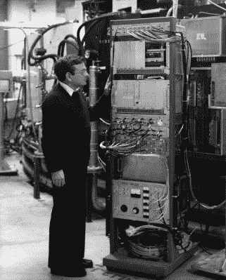

# 图说 CERN 竞赛进入第 8 周

> 原文：<https://hackaday.com/2015/03/26/caption-cern-contest-enters-week-8/>

感谢 [Hackaday.io.](http://hackaday.io/) 上的用户社区，CERN 竞赛进展顺利，竞赛刚刚结束第七周，为 CERN 存档的图片寻找有趣的标题。欧洲核子研究中心有几十年的他们的项目的伟大的照片文件。不幸的是，他们不知道每张照片是哪个项目的，也不知道照片里到底是谁。我们正在尽我们所能帮助他们，让欧洲核子研究中心知道我们能在他们的照片上找到的任何信息。一路上我们也玩得很开心，每周都会发一件最佳标题的 t 恤。

以下是第 7 周的一些最佳语录

#### 搞笑的是:

> “袜子和凉鞋是拆迁坑可以接受的安全装备吗？是的，因为这些是正在测试的 Kelvar 袜子和 Zylon 凉鞋。很不舒服，但这些脚会在近距离爆炸中幸存下来。”–[[控制我的键盘](http://hackaday.io/controlmypad)
> 
> “检查一下！每只忍者神龟一管”“[ [OzQube](http://hackaday.io/OzQube) ”
> 
> "在 LHC 之前，寻找希格斯粒子远没有那么迷人."–[[超光速粒子](http://hackaday.io/Tachyon)

获胜者当然是[ [Tim](http://hackaday.io/MrDucks) ，其特色图片位于本文顶部。

如果[超光速粒子]听起来很熟悉，那是因为他在第六周想出了最佳字幕[。第 6 周的亚军是:](http://hackaday.io/contest/4200-caption-cern-contest/log/15377-caption-cern-contest-week-6-winner)

> “该死的马里奥兄弟…..去救公主吧，看着你要去的地方。–[[斯科特·高尔文](http://hackaday.io/galvinscott2000)
> 
> “在欧洲粒子物理研究所，你不会受到歧视。你会被插管。”–[[rollyn 01](http://hackaday.io/Rollyn01)]
> 
> “感谢上帝分离器抓住了他。再过 50 米，他就只剩下夸克了。”–[[柯蒂斯·卡尔森](http://hackaday.io/CurtisC)

点击休息时间查看本周图片！

 欧洲粒子物理研究所的图书馆里有成千上万的带说明的图片，我们有很多工作要做！本周的图片展示了一位欧洲核子研究中心的科学家和一件看起来对他来说很特别的设备。你知道这个图像是怎么回事吗？

将您的幽默标题作为注释添加到[项目日志中。确保你是在评论日志，而不是项目本身。](http://hackaday.io/contest/4200-caption-cern-contest/log/15662-caption-cern-contest-week-8)

和往常一样，如果你真的有关于这张照片或照片中的人的信息，请在原照片讨论页面上告知 CERN。

祝你好运！