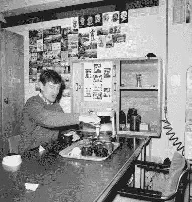

# 欧洲核子研究中心竞赛第 13 周

> 原文：<https://hackaday.com/2015/04/30/caption-cern-contest-week-13/>

欧洲核子研究中心竞赛第 12 周和它带来的奇怪的弦乐器都成为历史。一如既往，感谢您的字幕！在为我们的[黑客马拉松](https://hackaday.io/event/5213-hackaday-prize-worldwide-new-york-city/discussion-23628)做准备的繁忙的一周里，他们提供了不少笑料。我们仍然不确定这里到底在建什么——我们最好的猜测是它是某种排放探测器。但是什么样的排放呢？欧洲粒子物理研究所寻找的是电场、磁场，还是其他什么东西？有趣的是，就像摄影师的闪光灯在所有 5 层电线中反射一样，射频信号会从后反射器反弹并撞击电线。

搞笑的是:

*   “哦，太美了，这是竖琴吗？”
    “接近了，是为了 HAARP”——[[费德里科·丘尔卡-托鲁西奥](https://hackaday.io/fchurca)
*   " Bones 是对的，这东西会把你的分子分散到太空中."- [ [斯科特·高尔文](https://hackaday.io/galvinscott2000)
*   “八年的学校教育和两次博士后奖学金，就为了让我能做被子。我应该去当牙医。”–[[Narfnezzle Nickerbots](https://hackaday.io/Narfnezzle.Nickerbots)

本周的获奖者是[[thx 1082]](https://hackaday.io/THX1082)“欧洲粒子物理研究所发展“弦理论”的早期尝试”。他们做错了。[THX1082]将在他的下一次黑客空间会议上穿着来自 Hackaday 商店的 [CRT Android T 恤！](http://store.hackaday.com/products/crt-head-tee)

#### 第 13 周:欧洲粒子物理研究所的咖啡时间！

 每周我们都会收到至少一个说明，解释那周图片中的奇怪设备是一台咖啡机。我认为把这张 CERN 真实咖啡角落的照片和一位科学家即将享受一杯新鲜液体“搞定”的照片包括进来是正确的。不得不感谢 CERN 的摄影师抓拍到了这一段生活镜头！

值得花时间查看 CERN 的[高分辨率 JPEG，因为你可以真正放大背景中的明信片和照片。一个人甚至说“Tout va tres bien”——谷歌翻译成“一切都很好”。有些笑话永远不会过时！](https://cds.cern.ch/record/1830095/files/81-4-526.jpg)

将您的幽默标题作为评论添加到此项目日志中。确保你评论的是**[**比赛日志**](https://hackaday.io/contest/4200-caption-cern-contest/log/17133-caption-cern-contest-week-13) ，而不是比赛本身。**

 **一如既往，如果你真的有关于图像或图像中的人的信息，请在[原始图像讨论页面上让 CERN 知道。](https://cds.cern.ch/record/1830095)

祝你好运！**