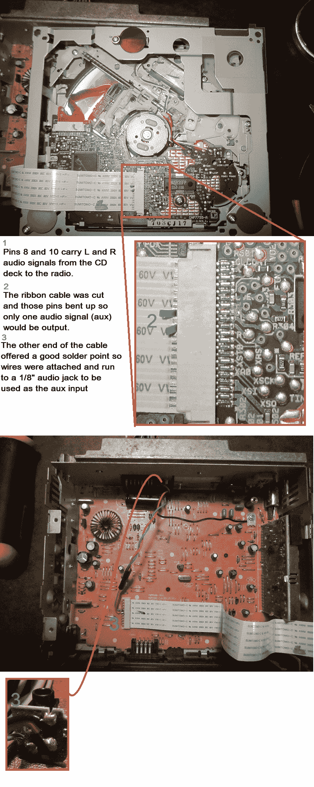

# 汽车立体声辅助输入接头接入 CD 带状电缆

> 原文：<https://hackaday.com/2013/06/28/car-stereo-aux-input-taps-into-cd-ribbon-cable/>

[Gezepi]想为他 1994 年的凯美瑞增加一个辅助输入。乍一看，没有一种简单的方法可以接入这个系统。但是用示波器探测了一下，发现他可以通过上面显示的 CD 带状电缆注入音频。CD 读取器是一个独立的单元，通过电缆接收命令，并将模拟立体声音频传送回音响主机的接收器部分。我们不确定他是如何知道要接入哪些引脚的，但这可能就像在播放 CD 时用耳机探测一样简单。

他被黑的程度记录在下图中。他切断了带状电缆 CD 侧的两条音频引线，然后将辅助插孔焊接在电缆连接器的接收器侧。这可以确保两个音频信号不会同时传入接收器。不幸的是，这也意味着他将不能使用 CD 播放器。我们已经看到了其他方法，它们使用特殊的音频插孔作为通道，当插入插孔时会切断连接。那就是[这次斯巴鲁黑](http://hackaday.com/2011/05/18/aux-in-hacking-an-04-subaru-radio/)用的方法。

