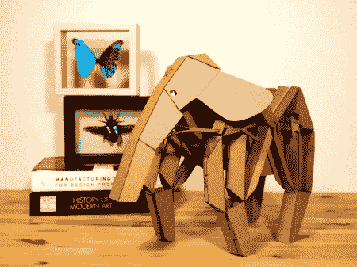

# 纸板运动生物

> 原文：<https://hackaday.com/2012/05/16/cardboard-kinetic-creatures/>

今天逛了逛，在 kickstarter 上看到了这个叫做[动能生物](http://www.kickstarter.com/projects/kineticcreatures/kinetic-creatures)的小工具包。这些扁平包装的模型由纸板制成，无需工具即可组装。它们的机械腿要么通过一个简单的凸轮来操作，要么通过一个电动附件来操作。我喜欢这里的基本理念。这是我 6 岁的孩子真正喜欢做的事情，也可以让他开始制作东西(他可能会坚持用废料来机动化它，他收集直流电机，并有相当多的收藏)。

我确实注意到他们提到将其用作机器人平台，在动物体内允许的空白空间添加定制的电子设备。这最初让我非常兴奋，认为我可以花 30 美元拥有一个 1 英尺高的四足平台，看起来很棒，然后我意识到它不能转弯。我想我得稍微改动一下，在每边放上单独的驱动器。这将是他们能提供的一个很酷的升级。

你们中有谁以前尝试过用一套只有 4 条腿的腿转弯吗？