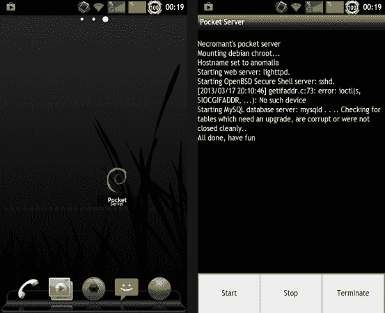

# 将 Git 服务器放在口袋里

> 原文：<https://hackaday.com/2013/03/19/carry-a-git-server-in-your-pocket/>

我们喜欢使用 Git，因为它有更好的版本控制。我们经常在一个公共的 Github 库中托管我们更高级的项目。但我们的大部分小实验只是简单的本地回购。如果你总是在家，这没问题，但是如果我们不在家，我们会发现自己不得不 SSH 到我们的服务器来复制 Git 文件。[Andrew]找到了绕过这个有点尴尬的过程的方法。他用一部旧的 Android 手机作为 Git 服务器。

当你开始思考这个问题时，你会发现它很有意义。大多数 Android 手机都有一个 microSD 卡插槽，以提供一个巨大的存储箱(Nexus 4 上没有这个令人困惑)，所以你不必担心空间不足。所有这些设备都有 WiFi，当周围没有任何其他 WiFi 时，可以很容易地将它们用作 AP。该设备的网络连接特性将使您在互联网上同步回购变得轻而易举。

大多数幕后工作都是使用 Debian 软件包完成的。这提供了[Andrew]一个一个走过的几个问题。我们也喜欢他的建议，比如在你的 EXTx 文件系统上使用“noatime”来避免 SD 卡的磨损。