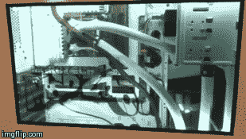
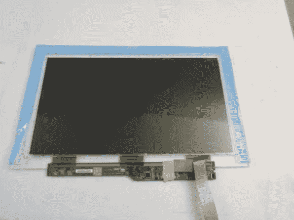

# 案例模块构建 LCD 窗口；导致迷幻药倒叙

> 原文：<https://hackaday.com/2013/12/31/case-modder-builds-lcd-window-causes-lsd-flashbacks/>

【克里斯，又名蚊子的 mods】以一些牛逼的 PC 外壳 Mods 而闻名。这一次他超越了自己，用一个[嵌入式液晶面板作为他的案例窗口。](http://themodzoo.com/forum/index.php?/topic/938-mod-visible-contrast-updated-18th-nov-2013-completed-photos-with-transparent-lcd/)LCD 在街机游戏和吃角子老虎机上的使用越来越普遍。[克里斯]的灵感来自他在当地戴夫&巴斯特商店看到的一款街机游戏。他从 AOC 的一个现成的 16”USB LCD 显示器开始。[Chris]然后去掉背光、漫射器和反射器。剩下裸露的面板和偏振镜，然后他创造了一种 LCD 三明治。首先是一层 2mm 厚的丙烯酸树脂。然后是液晶显示器和面板，以及 4 条丙烯酸形成一个围绕液晶显示器的框架。在中断后的图像中，帧条显示为蓝色。

最后一层是 6mm 厚的丙烯酸树脂。厚厚的丙烯酸树脂防止窗户组件弯曲，弯曲会导致 LCD 破裂。整个组件用 3M scotch 4010 胶带固定在一起。液晶显示器周围的白色 LED 灯条将大量光线照射到外壳中，从而可以看到液晶显示器上的图像。最终效果惊艳。LCD 上的图像似乎漂浮在窗户后面的空间中。这种效果在背景和白色图像上效果最好，因为颜色有点褪色是可以理解的。

[https://www.youtube.com/embed/5rVRJ_WjARs?version=3&rel=1&showsearch=0&showinfo=1&iv_load_policy=1&fs=1&hl=en-US&autohide=2&wmode=transparent](https://www.youtube.com/embed/5rVRJ_WjARs?version=3&rel=1&showsearch=0&showinfo=1&iv_load_policy=1&fs=1&hl=en-US&autohide=2&wmode=transparent)

[https://www.youtube.com/embed/P8BBS2Q3Vns?version=3&rel=1&showsearch=0&showinfo=1&iv_load_policy=1&fs=1&hl=en-US&autohide=2&wmode=transparent](https://www.youtube.com/embed/P8BBS2Q3Vns?version=3&rel=1&showsearch=0&showinfo=1&iv_load_policy=1&fs=1&hl=en-US&autohide=2&wmode=transparent)

【谢谢凯尔！]