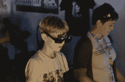
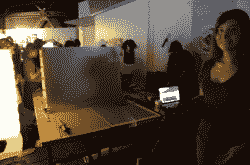
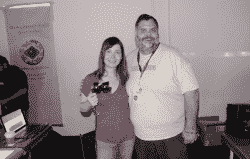

# 卡斯塔来到 2013 年纽约创客节

> 原文：<https://hackaday.com/2013/09/24/castar-comes-to-maker-faire-ny-2013/>

如果有一句话在纽约的 Maker Faire 上被反复听到，那就是“你看到 castAR 了吗？”技术幻象团队全力以赴参加 Maker Faire。[Jeri Ellsworth]，[Rick Johnson，]和他的团队带来了两个演示:经过验证的真实的 Jenga 模拟器，和一个基于 Unity 3D 引擎的更新的头顶射击游戏。我们没有从[之前的 castAR](http://hackaday.com/2013/05/31/jeri-spills-the-beans-on-her-ar-glasses/) 演示中看到任何惊天动地的变化，因为【Jeri】已经转向硬件的优化，而【Rick】则转向更加身临其境的软件演示。优化和为市场做准备被认为是任何产品设计的“硬码”。这是大量工作进行的地方，但对于外行人来说，这些变化是微妙的。

除了开发 castAR 的 ASIC 之外，[Jeri]还在光学方面努力工作。“老”眼镜使用固体塑料光路。新型眼镜为双 720p 投影仪使用了中空路径。这使得它们比上一代产品更轻。卡斯塔眼镜的重量不能被夸大。他们感觉非常轻。戴上它们时，鼻子或耳朵没有明显的压力。人们在虚拟现实中经常经历的晕动病也不见了。这是因为 castAR 并没有取代用户的视野，它只是扩大了视野。外围运动提示仍然存在，这使得体验更加舒适。

我们与[Rick]讨论了他面临的一些软件挑战。其中一人正在为眼镜上的双投影仪渲染两幅图像。为了把所有东西都装进眼镜里，右边的投影路径是反的。[Rick]必须创建一个倒置的光路来处理这个问题。演示旁边的 PC 设置显示了该软件正在做的所有工作，以从用户的角度创建无缝体验。

关于 castAR 最令人印象深刻的事情之一是当一个人离开投影仪的轴时，图像消失得有多快。这是 Technical phantoms 正在使用的逆向反射材料的一个特征。在现实世界中的意思是几个玩家可以共享同一个素材“游戏场”。

[https://www.youtube.com/embed/jJ1KxGIBnss?version=3&rel=1&showsearch=0&showinfo=1&iv_load_policy=1&fs=1&hl=en-US&autohide=2&wmode=transparent](https://www.youtube.com/embed/jJ1KxGIBnss?version=3&rel=1&showsearch=0&showinfo=1&iv_load_policy=1&fs=1&hl=en-US&autohide=2&wmode=transparent)

A young gamer tries out the castAR glasses.

The castAR booth

Jeri and Rick show off castAR