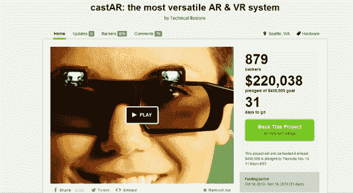

# CastAR 在 Kickstarter 上上线

> 原文：<https://hackaday.com/2013/10/15/castar-goes-live-on-kickstarter/>

【[杰瑞、瑞克和技术幻象剧组】已经带着 castAR 去 Kickstarter 了。](http://www.kickstarter.com/projects/technicalillusions/castar-the-most-versatile-ar-and-vr-system?ref=live)我们在过去已经[报道过 castAR](http://hackaday.com/2013/09/24/castar-comes-to-maker-faire-ny-2013/) 几次[，但是 Kickstarter 包括了一些刚刚成熟的新功能。首先，castAR 不再局限于反光表面。事实上，它不再局限于增强现实。一个可选的适配器上的剪辑将 castAR 转换为一个“免费”的增强现实或一个完整的虚拟现实系统。](http://hackaday.com/2013/05/31/jeri-spills-the-beans-on-her-ar-glasses/)

[Jeri]还在她的 YouTube 频道上发布了一段视频，详细介绍了 castAR 的整个发展历程(在跳伞后嵌入)。这个视频有一种真正的“心连心”的感觉，绝对值得一看。故事从[Rick]和[Jeri]在 Valve 度过的早期(和深夜)开始。她讲述了与 Valve 的分手，以及两人如何在[Rick 的]客厅建立实验室。[Jeri]还概述了该系统的一些技术方面。她解释了光学系统是如何从几磅重的投影仪缩小到我们今天看到的仅仅几盎司重。

另一个惊喜是战役的低等级奖励。提供 castAR 跟踪系统。该活动页面称，该跟踪系统可以安装在从机器人到其他虚拟现实耳机的任何东西上。黑客攻击的可能性几乎是无穷无尽的。我们很想建立我们自己的类似于宾夕法尼亚大学 Grasp 实验室的四轴飞行器群。RFID 跟踪网格也作为一个单独的选项提供。在游戏系统中，这将用于跟踪桌面游戏包。根据 Kickstarter 页面，听起来网格不仅会使用 RFID，还会使用基于摄像头的跟踪系统。我们很好奇这会有什么可能性。

在撰写本文时，castAR Kickstarter 活动已经走过了通往 40 万美元目标的一半路程。

[https://www.youtube.com/embed/cc2NQVQK69A?version=3&rel=1&showsearch=0&showinfo=1&iv_load_policy=1&fs=1&hl=en-US&autohide=2&wmode=transparent](https://www.youtube.com/embed/cc2NQVQK69A?version=3&rel=1&showsearch=0&showinfo=1&iv_load_policy=1&fs=1&hl=en-US&autohide=2&wmode=transparent)