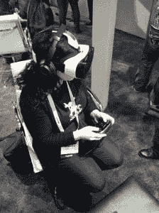
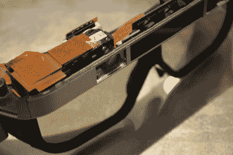
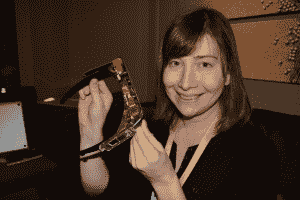

# CastAR 手把手地看下一个版本

> 原文：<https://hackaday.com/2015/01/12/castar-hands-on-and-off-record-look-at-next-version/>

我终于有机会试用 CastAR，这是一个由 Technical imaxics 开发的基于眼镜的增强现实系统。硬件已经在工作中好几年了，但是每次我们遇到演示时，我们都被伴随而来的长队所阻挠。这次我真的很幸运。[Jeri]在 CES 2015 期间在 Palazzo 的一个套房里给了我们一个私人演示。反思体验， [CastAR](http://technicalillusions.com/portfolio_page/castar-glasses/) 正是我一直渴望的虚拟现实硬件类型。

## 施法者 v oculus

CastAR glasses projecting on retroreflective material with the marker PCB seen to the right

【Sophi Kravitz】试用 Oculus Gear VR

我没有机会试用 Oculus 的新水晶湾(如上所述的长线路)，但我确实乘坐了 [Gear VR](http://www.samsung.com/global/microsite/gearvr/) 兜了一圈。Oculus Gear VR 是三星 Galaxy Note 4 的安装系统，用作游戏中的显示器。视角很好，色彩生动，我确实记得注意到像素，但我不会称之为像素化。但是事情是这样的，把这个绑在你的脸上，带上耳机，你就完全与世隔绝了。令人失望的不是禁闭，而是知道在虚拟现实设备被移除之前，无法与你周围的事物进行交互。

CastAR 完全解决了这个特殊的问题。硬件使用偏光眼镜，内置两个 720p 投影仪和两个摄像头。这种镜框感觉就像一副厚塑料框的大太阳镜，不会阻挡你的周边视觉或环视房间的能力。你可以围坐在桌子旁和朋友一起玩游戏，同时仍然正常地看着人和房间。当然，如果只有三个人在一个地方，并且想要第四个人参加晚上的庆祝活动，也可以远程观看体验的数字部分。

也许一个意想不到的特色演示是这样一个事实，即技术幻觉在酒店房间的长椅上覆盖了一些材料，它作为游戏表面表现得非常完美。由于逆反射器是织物，你可以把它卷起来随身携带。

休息之后，请和我一起观看硬件，并讨论下一个版本。

## 硬件

    

除了眼镜之外，CastAR 还依靠一台计算机来驱动体验，一个被动的红外标记器，相机用它来测量你的运动，以及一种反光材料，每个人的体验都投射在上面。把这种材料放在任何地方，投影仪就会用虚拟空间填满它。这确实是一个非凡的效果，因为光只能从它产生的确切角度反射。这意味着你会看到眼镜投射的光线，但你的同伴看不到。换句话说，多个佩戴 CastAR 的人看到他们自己的增强现实体验，他们不会相互干扰。一个简单的例子是人们在玩拼字游戏，他们都看到指向自己观点的字母。来自房间的环境光对您的投影也有可以忽略的影响，因为它会反射回光源，而不是朝向您的眼睛。

  Retroreflective material covering the marker whose IR LEDs are seen as small white squares  Bottom of the marker; USB port to the left is for power only. Each IR LED pulses an identifying pattern

我发现投影仪是一件不可思议的工程。[Jeri]讲述了她开发它们的经历。早期，她订购了库存镜头，并将许多镜头堆叠在一起，以达到理想的效果。接近生产时，她与一家光学公司签约，将她的原型变为现实。他们把她的镜头数输入到模拟软件中，并告诉她这种设置基本上是行不通的。经过一段时间的反复，包括[Jeri]交换公司规定的镜头订单，她最终做出了比专家更短的总光路。这是一个很明显的创新案例，因为她没有被“什么是可能的”所限制。

## 下一代硬件

技术幻想现在开始实现 Kickstarter 单元。但是[Jeri]已经在为硬件的下一个版本努力工作了。我问他们是否运行了比支持者数量更多的生产单元，以便将它们出售，他们没有。计划是在缩小尺寸的同时提高功能…大规模生产将等待这个比我想象的更接近的基准。

我不得不在这里兜圈子。[Jeri]向我展示了下一版本的投影仪/摄像机硬件的原型。AR/VR 世界竞争激烈，所以我不能分享一张图片或太多细节。我要说的是，我对模块变得如此之小感到惊讶。如果你不小心把板子、投影仪和照相机丢在你的口袋里，它们可能会丢失。

## 寻找不利因素

【Jeri ells worth】与目前运送给 Kickstarter 支持者的 CastAR 眼镜合影

我一直在试图思考这个系统的任何缺点。我唯一能想到的是，这是一个基于投影的系统。我一直觉得投影系统没有使用屏幕的显示器明亮和充满活力。也就是说，CastAR 的投影仪似乎表现得和任何消费类投影仪一样好。

当然，关于完全虚拟现实沉浸的个人观点将与我的不同。如果你想用数字世界完全取代你的周围环境，这可能会被认为是一个缺点。与此同时，在看到 CastAR 可以用散落在房间里的反光材料做什么后，我猜想有人会用头罩或整个房间的材料(全息甲板)将它砍成完整的 VR。我唯一的问题是，这将由 Kickstarter 的支持者之一先做，还是由[Jeri]和[Rick]他们自己先做？