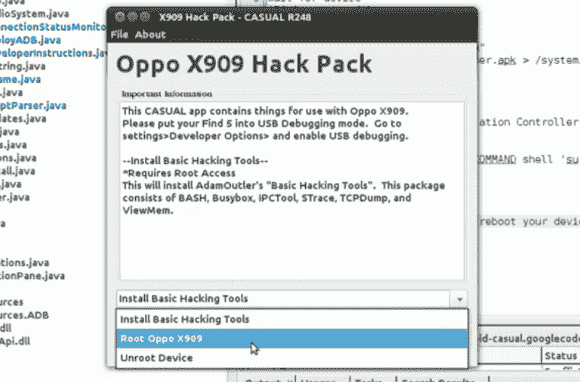

# 休闲寻求使 Android 黑客操作系统不可知

> 原文：<https://hackaday.com/2013/02/04/casual-seeks-to-make-android-hacking-os-agnostic/>

[Adam Outler]向我们透露了他正在开发的跨平台 Android 黑客套件。这个名为“休闲”的项目带来了几样东西。首先也是最重要的，它打破了一些黑客看到的操作系统要求。它可以执行几乎所有的安卓黑客攻击，不管你用的是 Linux、OS X 还是 Windows。

休息之后我们嵌入了两段视频。上面看到的截图来自第一个剪辑，其中[Adam]演示了 Oppo Find5 Android 手机的软件包。然后，他继续展示临时使用的脚本语言。这一抽象层应该使部署黑客包变得更容易，因为 CASUAL 处理所有底层工具，如 Android Debug Bridge、fastboot 和 Heimdall(一个开源 Odin 替代品，它将底层工具带到了所有 OS 平台)。第二个视频演示了一个 Galaxy Note II 正在被根化，并有一个新的恢复映像闪现。

[https://www.youtube.com/embed/loXdGCp0p6k?version=3&rel=1&showsearch=0&showinfo=1&iv_load_policy=1&fs=1&hl=en-US&autohide=2&wmode=transparent](https://www.youtube.com/embed/loXdGCp0p6k?version=3&rel=1&showsearch=0&showinfo=1&iv_load_policy=1&fs=1&hl=en-US&autohide=2&wmode=transparent)

[https://www.youtube.com/embed/yWVQiTffDdQ?version=3&rel=1&showsearch=0&showinfo=1&iv_load_policy=1&fs=1&hl=en-US&autohide=2&wmode=transparent](https://www.youtube.com/embed/yWVQiTffDdQ?version=3&rel=1&showsearch=0&showinfo=1&iv_load_policy=1&fs=1&hl=en-US&autohide=2&wmode=transparent)