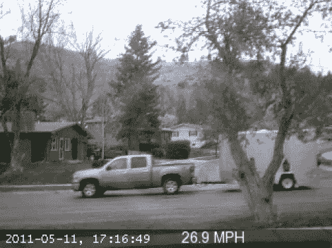

# 用你的网络摄像头捕捉邻居超速者

> 原文：<https://hackaday.com/2012/05/31/catch-neighborhood-speeders-with-your-webcam/>

[约翰]正在通过留意超速者来保证社区的安全。他真的为超速者准备了一个摄像头。他的技术不使用雷达或激光。他正在用 Python 处理网络摄像头帧来计算速度。

这归结为一些基本的图像处理。他首先通过一个名为 YawCam 的运动检测网络摄像头程序收集必要的图像进行计算。分析图像以确定帧之间哪些部分已经改变；这就去掉了所有静止的物体。现在可以比较这些帧，以像素为单位确定距离。通过校准目标区域的穿透测量，该数据可以直接转换成实际距离。然后将它与每一帧的时间戳进行比较，以得出速度。这可以用于我们上面看到的街道上的车辆，或者更异想天开的测量，如宠物龟进度。