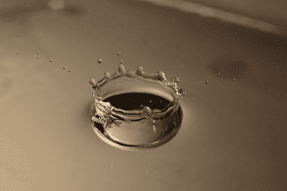
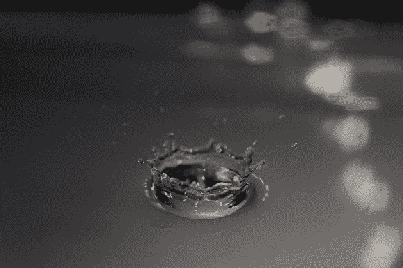

# 用发光二极管捕捉水滴

> 原文：<https://hackaday.com/2014/05/19/catching-drops-of-water-with-leds/>

有没有想过他们如何[捕捉看似完美的水滴照片？](http://lcamtuf.coredump.cx/water/)大多数情况下，这是通过使用光遮断器来完成的，它可以检测到水滴的下落，然后在几毫秒后触发光源，此时您的相机已准备就绪并处于等待状态。

这通常是通过一种名为[气隙闪光灯](http://hackaday.com/2013/10/24/a-much-more-dyi-air-gap-flash-unit/)的东西来完成的，这通常是[相当昂贵的](http://hackaday.com/2011/01/10/diy-air-gap-flash-saves-at-least-seven-grand/)或[难以制造的](http://hackaday.com/2013/10/22/making-an-airgap-flash/)，但【Michal’s】找到了另一种更简单的适合某些应用的方法——使用 led 阵列来照亮场景。

他有一个红外二极管，一个光敏电阻，几个垫片，一些塑料和一堆热熔胶来组成他的光断续器。当水滴通过红外光束时，它中断了来自光敏电阻的信号，然后触发他的 ATmega48P。它等待 80 毫秒(他超时了)，然后打开 led 大约 50 **微**秒。与此同时，他的相机以几秒钟的快门速度监视着整个事件。

这是因为 LED 的上升和下降时间比传统的相机闪光灯短得多——普通闪光灯点亮 1-2 毫秒，而这种 50 微秒的 LED 闪光灯则相反。看一看其中的一些图片吧！

